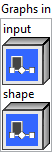

<h1>Expand</h1>

<h2>Description</h2>

Broadcast the input tensor following the given shape and the broadcast rule. The broadcast rule is similar to numpy.array(input) * numpy.ones(shape): Dimensions are right alignment; Two corresponding dimensions must have the same value, or one of them is equal to 1. Also, this operator is similar to numpy.broadcast_to(input, shape), but the major difference is numpy.broadcast_to() does not allow shape to be smaller than input.size(). It is possible that the output.shape is not equal to shape, when some dimensions in shape is equal to 1, or the shape.ndim &lt; input.shape.ndim.

<h3>Input parameters</h3>

<table>
  <tbody>
    <tr>
      <td width="64" valign="top"></td>
      <td valign="top"><strong><a href="../../deep-learning/more-deep-learning/nodes-parameters/specified_outputs_name/README.md">specified_outputs_name</a> : <em>array, </em></strong>this parameter lets you manually assign custom names to the output tensors of a node.</td>
    </tr>
  </tbody>
</table>

<table>
  <tbody>
    <tr>
      <td valign="top" width="70%"><table>
  <tbody>
    <tr>
      <td width="64" valign="top"></td>
      <td valign="top"><strong>Graphs in :</strong> <strong><em>cluster,</em></strong> ONNX model architecture.</td>
    </tr>
    <tr>
      <td></td>
      <td valign="top"><table>
  <tbody>
    <tr>
      <td width="64" valign="top"></td>
      <td valign="top"><strong>input</strong> <strong>(heterogeneous) –</strong> <strong>T :</strong> <em><strong>object,</strong></em> input tensor.</td>
    </tr>
    <tr>
      <td width="64" valign="top"></td>
      <td valign="top"><strong>shape (heterogeneous) – tensor(int64) : <em>object, </em></strong>a 1-D tensor indicates the shape you want to expand to, following the broadcast rule.</td>
    </tr>
  </tbody>
</table></td>
    </tr>
  </tbody>
</table></td>
      <td valign="top" width="30%">

</td>
    </tr>
  </tbody>
</table>

<table>
  <tbody>
    <tr>
      <td valign="top" width="70%"><table>
  <tbody>
    <tr>
      <td width="64" valign="top"></td>
      <td valign="top"><strong>Parameters : <em>cluster,</em></strong></td>
    </tr>
    <tr>
      <td></td>
      <td valign="top"><table>
  <tbody>
    <tr>
      <td width="64" valign="top"></td>
      <td valign="top"><strong>training? :</strong> <em><strong>boolean</strong><strong>,</strong></em> whether the layer is in training mode (can store data for backward).</td>
    </tr>
    <tr>
      <td width="64" valign="top"></td>
      <td valign="top">Default value “True”.</td>
    </tr>
    <tr>
      <td width="64" valign="top"></td>
      <td valign="top"><strong>lda coeff :</strong> <em><strong>float</strong><strong>,</strong></em> defines the coefficient by which the loss derivative will be multiplied before being sent to the previous layer (since during the backward run we go backwards).</td>
    </tr>
    <tr>
      <td width="64" valign="top"></td>
      <td valign="top">Default value “1”.</td>
    </tr>
  </tbody>
</table></td>
    </tr>
    <tr>
      <td width="64" valign="top"></td>
      <td valign="top"><strong>name (optional) :</strong> <em><strong>string,</strong></em> name of the node.</td>
    </tr>
  </tbody>
</table></td>
      <td valign="top" width="30%">

</td>
    </tr>
  </tbody>
</table>

<h3>Output parameters</h3>

<table>
  <tbody>
    <tr>
      <td width="64" valign="top"></td>
      <td valign="top"><strong>output (heterogeneous) – T :</strong> <em><strong>object,</strong></em> output tensor.</td>
    </tr>
  </tbody>
</table>

<h2>Type Constraints</h2>

<strong>T</strong> in (<code>tensor(bfloat16)</code>, <code>tensor(bool)</code>, <code>tensor(complex128)</code>, <code>tensor(complex64)</code>, <code>tensor(double)</code>, <code>tensor(float)</code>, <code>tensor(float16)</code>,  <code>tensor(int16)</code>, <code>tensor(int32)</code>, <code>tensor(int64)</code>, <code>tensor(int8)</code>, <code>tensor(string)</code>, <code>tensor(uint16)</code>, <code>tensor(uint32)</code>, <code>tensor(uint64)</code>, <code>tensor(uint8)</code>) : Constrain input and output types to all tensors.

<h2>Example</h2>

All these exemples are snippets PNG, you can drop these Snippet onto the block diagram and get the depicted code added to your VI (Do not forget to install Deep Learning library to run it).

