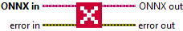

<h1>Close</h1>

<h2>Description</h2>

Close Session.

<h3>Input parameters</h3>

<table>
  <tbody>
    <tr>
      <td width="64" valign="top"></td>
      <td valign="top"><strong>ONNX in : <em>object, </em></strong>the ONNX object serves as the parent class that provides the core structure and functionalities used by inference.</td>
    </tr>
  </tbody>
</table>

<h3>Output parameters</h3>

<table>
  <tbody>
    <tr>
      <td width="64" valign="top"></td>
      <td valign="top"><strong>ONNX out : <em>object, </em></strong>the ONNX object serves as the parent class that provides the core structure and functionalities used by inference.</td>
    </tr>
  </tbody>
</table>

<h2>Example</h2>

All these exemples are snippets PNG, you can drop these Snippet onto the block diagram and get the depicted code added to your VI (Do not forget to install Accelerator library to run it).

