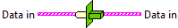
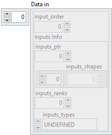

<h1>Convert</h1>

<h2>Description</h2>

Allocate and copy data to Cuda Ptr for all inputs and store the ptr into the cluster. Type : <em><strong>polymorphic</strong><strong>. </strong></em><strong>Warning : The Cuda Ptr allocated by this functions need to be free.</strong>

<h3>Input parameters</h3>

<table>
  <tbody>
    <tr>
      <td valign="top" width="70%"><table>
  <tbody>
    <tr>
      <td width="64" valign="top"></td>
      <td valign="top"><strong>Data in : <em>array, </em></strong>is an array of clusters, where each cluster represents a single model input. Each cluster contains metadata and raw data required to describe and pass an input tensor to the model.</td>
    </tr>
    <tr>
      <td></td>
      <td valign="top"><table>
  <tbody>
    <tr>
      <td width="64" valign="top"></td>
      <td valign="top"><strong>input_order : <em>integer</em>,</strong> defines the position of the input within the data array. It corresponds to the index assigned to the input when it is created (via the <i>index</i> parameter).</td>
    </tr>
    <tr>
      <td width="64" valign="top"></td>
      <td valign="top"><strong>Inputs Info : <em>cluster</em></strong></td>
    </tr>
    <tr>
      <td></td>
      <td valign="top"><table>
  <tbody>
    <tr>
      <td width="64" valign="top"></td>
      <td valign="top"><strong>inputs_data : <em>array, </em></strong>contains the raw byte representation of the input tensor data, stored as a 1D flattened buffer.</td>
    </tr>
    <tr>
      <td width="64" valign="top"></td>
      <td valign="top">inputs_shapes :<em> array, </em>specifies the shape of the input tensor. Since the data is stored as a flattened 1D buffer, this shape is necessary to reconstruct the original dimensions.</td>
    </tr>
    <tr>
      <td width="64" valign="top"></td>
      <td valign="top">inputs string length : <em>array, </em>used when the tensor type is string. If the tensor has shape <code>[5,3]</code>, this field contains 15 values, each representing the length of a corresponding string element. This ensures that the actual size of <code>inputs_data</code> is known despite variable string lengths.</td>
    </tr>
    <tr>
      <td width="64" valign="top"></td>
      <td valign="top">inputs_ranks :<em> array, </em>indicates the rank of the tensor, i.e. the number of dimensions (Scalar = 0, 1D = 1, 2D = 2, etc.).</td>
    </tr>
    <tr>
      <td width="64" valign="top"></td>
      <td valign="top">inputs_types :<em> array, </em>defines the ONNX tensor type as an enumerated value (e.g. FLOAT, INT64, STRING).</td>
    </tr>
  </tbody>
</table></td>
    </tr>
  </tbody>
</table></td>
    </tr>
  </tbody>
</table>

​
</td>
      <td valign="top" width="30%">

</td>
    </tr>
  </tbody>
</table>

<h3>Output parameters</h3>

<table>
  <tbody>
    <tr>
      <td valign="top" width="70%"><table>
  <tbody>
    <tr>
      <td width="64" valign="top"></td>
      <td valign="top"><strong>Data in : <em>array,</em></strong></td>
    </tr>
    <tr>
      <td></td>
      <td valign="top"><table>
  <tbody>
    <tr>
      <td width="64" valign="top"></td>
      <td valign="top"><strong>input_order : <em>integer</em>,</strong> defines the position of the output within the data array. It corresponds to the index assigned to the output when it is created (via the index parameter).</td>
    </tr>
    <tr>
      <td width="64" valign="top"></td>
      <td valign="top"><strong>Inputs Info : <em>cluster</em></strong></td>
    </tr>
    <tr>
      <td></td>
      <td valign="top"><table>
  <tbody>
    <tr>
      <td width="64" valign="top"></td>
      <td valign="top"><strong>inputs_ptr : <em>integer, </em></strong>represents a pre-allocated device memory address (for example, a CUDA device pointer) where the input tensor data is already stored.</td>
    </tr>
    <tr>
      <td width="64" valign="top"></td>
      <td valign="top">inputs_shapes :<em> array, </em>specifies the shape of the output tensor. Since the data is written into a pre-allocated device buffer, this shape allows the runtime to interpret the memory layout correctly.</td>
    </tr>
    <tr>
      <td width="64" valign="top"></td>
      <td valign="top">inputs_ranks :<em> integer, </em>indicates the rank of the tensor, i.e. the number of dimensions (Scalar = 0, 1D = 1, 2D = 2, etc.).</td>
    </tr>
    <tr>
      <td width="64" valign="top"></td>
      <td valign="top">inputs_types :<em> enum, </em>defines the ONNX tensor type as an enumerated value (e.g. FLOAT, INT64, STRING).</td>
    </tr>
  </tbody>
</table></td>
    </tr>
  </tbody>
</table></td>
    </tr>
  </tbody>
</table></td>
      <td valign="top" width="30%">

</td>
    </tr>
  </tbody>
</table>

<h2>Example</h2>

All these exemples are snippets PNG, you can drop these Snippet onto the block diagram and get the depicted code added to your VI (Do not forget to install Accelerator library to run it).

