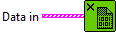

<h1>Free CUDA</h1>

<h2>Description</h2>

Free all the ptrs inside the Data in array. Type : <em><strong>polymorphic</strong><strong>.</strong></em>

<h3>Input parameters</h3>

<table>
  <tbody>
    <tr>
      <td valign="top" width="70%"><table>
  <tbody>
    <tr>
      <td width="64" valign="top"></td>
      <td valign="top"><strong>Data in : <em>array,</em></strong></td>
    </tr>
    <tr>
      <td></td>
      <td valign="top"><table>
  <tbody>
    <tr>
      <td width="64" valign="top"></td>
      <td valign="top"><strong>input_order : <em>integer</em>,</strong> defines the position of the output within the data array. It corresponds to the index assigned to the output when it is created (via the index parameter).</td>
    </tr>
    <tr>
      <td width="64" valign="top"></td>
      <td valign="top"><strong>Inputs Info : <em>cluster</em></strong></td>
    </tr>
    <tr>
      <td></td>
      <td valign="top"><table>
  <tbody>
    <tr>
      <td width="64" valign="top"></td>
      <td valign="top"><strong>inputs_ptr : <em>integer, </em></strong>represents a pre-allocated device memory address (for example, a CUDA device pointer) where the input tensor data is already stored.</td>
    </tr>
    <tr>
      <td width="64" valign="top"></td>
      <td valign="top">inputs_shapes :<em> array, </em>specifies the shape of the output tensor. Since the data is written into a pre-allocated device buffer, this shape allows the runtime to interpret the memory layout correctly.</td>
    </tr>
    <tr>
      <td width="64" valign="top"></td>
      <td valign="top">inputs_ranks :<em> integer, </em>indicates the rank of the tensor, i.e. the number of dimensions (Scalar = 0, 1D = 1, 2D = 2, etc.).</td>
    </tr>
    <tr>
      <td width="64" valign="top"></td>
      <td valign="top">inputs_types :<em> enum, </em>defines the ONNX tensor type as an enumerated value (e.g. FLOAT, INT64, STRING).</td>
    </tr>
  </tbody>
</table></td>
    </tr>
  </tbody>
</table></td>
    </tr>
  </tbody>
</table></td>
      <td valign="top" width="30%">

</td>
    </tr>
  </tbody>
</table>

<h2>Example</h2>

All these exemples are snippets PNG, you can drop these Snippet onto the block diagram and get the depicted code added to your VI (Do not forget to install Accelerator library to run it).

