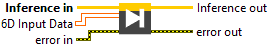

<h1>6D</h1>

<h2>Description</h2>

Execute forward with 6D Float Data (Inference Session).

<h3>Input parameters</h3>

<table>
  <tbody>
    <tr>
      <td width="64" valign="top"></td>
      <td valign="top"><strong>Inference in</strong> <strong>: <em>object, </em></strong>inference session.</td>
    </tr>
    <tr>
      <td width="64" valign="top"></td>
      <td valign="top"><strong>6D Input Data : <em>array</em>, </strong>6D array of data with any type : integers (signed/unsigned), floats, doubles, booleans, or strings.</td>
    </tr>
  </tbody>
</table>

<h3>Output parameters</h3>

<table>
  <tbody>
    <tr>
      <td width="64" valign="top"></td>
      <td valign="top"><strong>Inference out</strong> <strong>: <em>object, </em></strong>inference session.</td>
    </tr>
  </tbody>
</table>

<h2>Example</h2>

All these exemples are snippets PNG, you can drop these Snippet onto the block diagram and get the depicted code added to your VI (Do not forget to install Accelerator library to run it).

