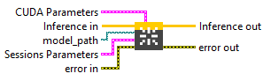
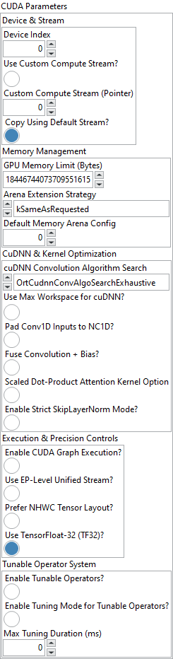

<h1>CUDA</h1>

<h3>Description</h3>

Create Cuda Session with its Session Options on the stored local Env. Type : <em><strong>polymorphic</strong><strong>.</strong></em>

<h3>Input parameters</h3>

<table>
  <tbody>
    <tr>
      <td width="64" valign="top"></td>
      <td valign="top"><strong> Inference in : <em>object, </em></strong>inference session.</td>
    </tr>
    <tr>
      <td width="64" valign="top"></td>
      <td valign="top"><strong> model_path : <em>path, </em></strong>is the path to the model file.</td>
    </tr>
  </tbody>
</table>

<table>
  <tbody>
    <tr>
      <td valign="top" width="70%"><table>
  <tbody>
    <tr>
      <td width="64" valign="top"></td>
      <td valign="top"><strong>Sessions Parameters : <i>cluster</i></strong></td>
    </tr>
    <tr>
      <td></td>
      <td valign="top"><table>
  <tbody>
    <tr>
      <td width="64" valign="top"></td>
      <td valign="top"><strong>intra_op_num_threads : <i>integer, </i></strong>number of threads used within each operator to parallelize computations. If the value is 0, ONNX Runtime automatically uses the number of physical CPU cores.</td>
    </tr>
    <tr>
      <td width="64" valign="top"></td>
      <td valign="top"><strong>inter_op_num_threads : <i>integer, </i></strong>number of threads used between operators, to execute multiple graph nodes in parallel. If set to 0, this parameter is ignored when <code>execution_mode</code> is <code>ORT_SEQUENTIAL</code>. In <code>ORT_PARALLEL</code> mode, 0 means ORT automatically selects a suitable number of threads (usually equal to the number of cores).</td>
    </tr>
    <tr>
      <td width="64" valign="top"></td>
      <td valign="top"><strong>execution_mode : <em>enum</em>, </strong>controls whether the graph executes nodes one after another or allows parallel execution when possible<strong>.</strong><code>ORT_SEQUENTIAL</code> runs nodes in order, <code>ORT_PARALLEL</code> runs them concurrently.</td>
    </tr>
    <tr>
      <td width="64" valign="top"></td>
      <td valign="top">deterministic_compute : <em>boolean, </em>forces deterministic execution, meaning results will always be identical for the same inputs.</td>
    </tr>
    <tr>
      <td width="64" valign="top"></td>
      <td valign="top"><strong>graph_optimization_level : <em>enum</em>, </strong>defines how much ONNX Runtime optimizes the computation graph before running the model.</td>
    </tr>
    <tr>
      <td width="64" valign="top"></td>
      <td valign="top">optimized_model_file_path : <em>path</em>, file path to save the optimized model after graph analysis.</td>
    </tr>
    <tr>
      <td width="64" valign="top"></td>
      <td valign="top"><strong> profiling output dir : <em>path</em>, </strong>specifies the directory where ONNX Runtime will save profiling output files. If you set this parameter to a valid (non-empty) path, profiling is automatically enabled. However, if the path is empty, profiling will not be activated.</td>
    </tr>
  </tbody>
</table></td>
    </tr>
  </tbody>
</table></td>
      <td valign="top" width="30%">

</td>
    </tr>
  </tbody>
</table>

<table>
  <tbody>
    <tr>
      <td valign="top" width="70%"><table>
  <tbody>
    <tr>
      <td width="64" valign="top"></td>
      <td valign="top"><strong>CUDA Parameters : <i>cluster</i></strong></td>
    </tr>
    <tr>
      <td></td>
      <td valign="top"><table>
  <tbody>
    <tr>
      <td width="64" valign="top"></td>
      <td valign="top"><strong>Device &amp; Stream : <i>cluster,</i></strong></td>
    </tr>
    <tr>
      <td></td>
      <td valign="top"><table>
  <tbody>
    <tr>
      <td width="64" valign="top"></td>
      <td valign="top"><strong>Device Index :</strong><em><strong> integer,</strong></em> ID of the CUDA device used for inference (default = 0).</td>
    </tr>
    <tr>
      <td width="64" valign="top"></td>
      <td valign="top"><strong>Use Custom Compute Stream? : <em>boolean,</em></strong> if true, the model will run using a user-provided CUDA compute stream.</td>
    </tr>
    <tr>
      <td width="64" valign="top"></td>
      <td valign="top"><strong>Custom Compute Stream (Pointer) : <em>integer,</em></strong> pointer or reference to the user CUDA stream.</td>
    </tr>
    <tr>
      <td width="64" valign="top"></td>
      <td valign="top"><strong>Copy Using Default Stream? : <em>boolean,</em></strong> if true, host-device transfers are executed in the default CUDA stream.</td>
    </tr>
  </tbody>
</table></td>
    </tr>
    <tr>
      <td width="64" valign="top"></td>
      <td valign="top"><strong>Memory Management : <i>cluster,</i></strong></td>
    </tr>
    <tr>
      <td></td>
      <td valign="top"><table>
  <tbody>
    <tr>
      <td width="64" valign="top"></td>
      <td valign="top"><strong>GPU Memory Limit (Bytes) : <em>integer,</em></strong> maximum GPU memory the CUDA EP can allocate (default = unlimited).</td>
    </tr>
    <tr>
      <td width="64" valign="top"></td>
      <td valign="top"><strong>Arena Extension Strategy</strong> <strong>: <em>enum,</em></strong> defines how the GPU memory arena grows : “NextPowerOfTwo” (default) or “SameAsRequested”.</td>
    </tr>
    <tr>
      <td width="64" valign="top"></td>
      <td valign="top"><strong>Default Memory Arena Config : <em>integer,</em></strong> optional pointer to a custom OrtArenaCfg; overrides other memory parameters.</td>
    </tr>
  </tbody>
</table></td>
    </tr>
    <tr>
      <td width="64" valign="top"></td>
      <td valign="top"><strong>CuDNN &amp; Kernel Optimization</strong> <strong>: <i>cluster,</i></strong></td>
    </tr>
    <tr>
      <td></td>
      <td valign="top"><table>
  <tbody>
    <tr>
      <td width="64" valign="top"></td>
      <td valign="top"><strong>cuDNN Convolution Algorithm Search</strong> <strong>: <em>enum,</em></strong> strategy for cuDNN convolution kernel selection : Exhaustive, Heuristic, or Default.</td>
    </tr>
    <tr>
      <td width="64" valign="top"></td>
      <td valign="top"><strong>Use Max Workspace for cuDNN? : <em>boolean,</em></strong> if true, cuDNN may use the largest available workspace for best performance.</td>
    </tr>
    <tr>
      <td width="64" valign="top"></td>
      <td valign="top"><strong>Pad Conv1D Inputs to NC1D? : <em>boolean,</em></strong> automatically pads 1D convolution inputs to [N,C,1,D] or [N,C,D,1] for compatibility.</td>
    </tr>
    <tr>
      <td width="64" valign="top"></td>
      <td valign="top"><strong>Fuse Convolution + Bias? : <em>boolean,</em></strong> enables cuDNN Frontend fusion of convolution and bias layers (JIT-compiled kernels).</td>
    </tr>
    <tr>
      <td width="64" valign="top"></td>
      <td valign="top"><strong>Scaled Dot-Product Attention Kernel Option : <em>boolean,</em></strong> selects the implementation of the SDPA kernel (0 = default).</td>
    </tr>
    <tr>
      <td width="64" valign="top"></td>
      <td valign="top"><strong>Enable Strict SkipLayerNorm Mode? : <em>boolean,</em></strong> forces LayerNormalization kernel instead of SkipLayerNorm for higher accuracy at lower speed.</td>
    </tr>
  </tbody>
</table></td>
    </tr>
    <tr>
      <td width="64" valign="top"></td>
      <td valign="top"><strong>Execution &amp; Precision Controls</strong> <strong>: <i>cluster,</i></strong></td>
    </tr>
    <tr>
      <td></td>
      <td valign="top"><table>
  <tbody>
    <tr>
      <td width="64" valign="top"></td>
      <td valign="top"><strong>Enable CUDA Graph Execution? : <em>boolean,</em></strong> captures model execution as a CUDA Graph for reduced launch overhead (requires static shapes).</td>
    </tr>
    <tr>
      <td width="64" valign="top"></td>
      <td valign="top"><strong>Use EP-Level Unified Stream? : <em>boolean,</em></strong> runs all CUDA operations through one unified execution stream at the provider level.</td>
    </tr>
    <tr>
      <td width="64" valign="top"></td>
      <td valign="top"><strong>Prefer NHWC Tensor Layout? : <em>boolean,</em></strong> uses NHWC (channels-last) tensor format where supported for better memory access.</td>
    </tr>
    <tr>
      <td width="64" valign="top"></td>
      <td valign="top"><strong>Use TensorFloat-32 (TF32)? : <em>boolean,</em></strong> enables TensorFloat-32 tensor cores (default = true) for faster matrix math with minimal precision loss.</td>
    </tr>
  </tbody>
</table></td>
    </tr>
    <tr>
      <td width="64" valign="top"></td>
      <td valign="top"><strong>Tunable Operator System</strong> <strong>: <i>cluster,</i></strong></td>
    </tr>
    <tr>
      <td></td>
      <td valign="top"><table>
  <tbody>
    <tr>
      <td width="64" valign="top"></td>
      <td valign="top"><strong>Enable Tunable Operators? : <em>boolean,</em></strong> activates runtime operator tuning for optimal kernel selection.</td>
    </tr>
    <tr>
      <td width="64" valign="top"></td>
      <td valign="top"><strong>Enable Tuning Mode for Tunable Operators? : <em>boolean,</em></strong> allows benchmarking multiple kernel variants to select the fastest one.</td>
    </tr>
    <tr>
      <td width="64" valign="top"></td>
      <td valign="top"><strong>Max Tuning Duration (ms) : <em>integer,</em></strong> maximum duration (in milliseconds) for kernel tuning before fallback to default.</td>
    </tr>
  </tbody>
</table></td>
    </tr>
  </tbody>
</table></td>
    </tr>
  </tbody>
</table></td>
      <td valign="top" width="30%">

</td>
    </tr>
  </tbody>
</table>

<h3>Output parameters</h3>

<table>
  <tbody>
    <tr>
      <td width="64" valign="top"></td>
      <td valign="top"><strong>Inference out</strong> <strong>: <em>object, </em></strong>inference session.</td>
    </tr>
  </tbody>
</table>

<h2>Example</h2>

All these exemples are snippets PNG, you can drop these Snippet onto the block diagram and get the depicted code added to your VI (Do not forget to install Accelerator library to run it).

