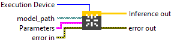

<h1>Default</h1>

<h3>Description</h3>

Create a Session. Type : <em><strong>polymorphic</strong><strong>.</strong></em>

<h3>Input parameters</h3>

<table>
  <tbody>
    <tr>
      <td width="64" valign="top"></td>
      <td valign="top"><strong>Execution Device : <em>enum</em>, </strong>selects the hardware device on which the model will run.</td>
    </tr>
    <tr>
      <td width="64" valign="top"></td>
      <td valign="top"><strong> model_path : <em>path, </em></strong>is the path to the model file.</td>
    </tr>
  </tbody>
</table>

<table>
  <tbody>
    <tr>
      <td valign="top" width="70%"><table>
  <tbody>
    <tr>
      <td width="64" valign="top"></td>
      <td valign="top"><strong>Sessions Parameters : <i>cluster</i></strong></td>
    </tr>
    <tr>
      <td></td>
      <td valign="top"><table>
  <tbody>
    <tr>
      <td width="64" valign="top"></td>
      <td valign="top"><strong>intra_op_num_threads : <i>integer, </i></strong>number of threads used within each operator to parallelize computations. If the value is 0, ONNX Runtime automatically uses the number of physical CPU cores.</td>
    </tr>
    <tr>
      <td width="64" valign="top"></td>
      <td valign="top"><strong>inter_op_num_threads : <i>integer, </i></strong>number of threads used between operators, to execute multiple graph nodes in parallel. If set to 0, this parameter is ignored when <code>execution_mode</code> is <code>ORT_SEQUENTIAL</code>. In <code>ORT_PARALLEL</code> mode, 0 means ORT automatically selects a suitable number of threads (usually equal to the number of cores).</td>
    </tr>
    <tr>
      <td width="64" valign="top"></td>
      <td valign="top"><strong>execution_mode : <em>enum</em>, </strong>controls whether the graph executes nodes one after another or allows parallel execution when possible<strong>.</strong><code>ORT_SEQUENTIAL</code> runs nodes in order, <code>ORT_PARALLEL</code> runs them concurrently.</td>
    </tr>
    <tr>
      <td width="64" valign="top"></td>
      <td valign="top">deterministic_compute : <em>boolean, </em>forces deterministic execution, meaning results will always be identical for the same inputs.</td>
    </tr>
    <tr>
      <td width="64" valign="top"></td>
      <td valign="top"><strong>graph_optimization_level : <em>enum</em>, </strong>defines how much ONNX Runtime optimizes the computation graph before running the model.</td>
    </tr>
    <tr>
      <td width="64" valign="top"></td>
      <td valign="top">optimized_model_file_path : <em>path</em>, file path to save the optimized model after graph analysis.</td>
    </tr>
    <tr>
      <td width="64" valign="top"></td>
      <td valign="top"><strong> profiling output dir : <em>path</em>, </strong>specifies the directory where ONNX Runtime will save profiling output files. If you set this parameter to a valid (non-empty) path, profiling is automatically enabled. However, if the path is empty, profiling will not be activated.</td>
    </tr>
  </tbody>
</table></td>
    </tr>
  </tbody>
</table></td>
      <td valign="top" width="30%">

</td>
    </tr>
  </tbody>
</table>

<h3>Output parameters</h3>

<table>
  <tbody>
    <tr>
      <td width="64" valign="top"></td>
      <td valign="top"><strong>Inference out</strong> <strong>: <em>object, </em></strong>inference session.</td>
    </tr>
  </tbody>
</table>

<h2>Example</h2>

All these exemples are snippets PNG, you can drop these Snippet onto the block diagram and get the depicted code added to your VI (Do not forget to install Accelerator library to run it).

