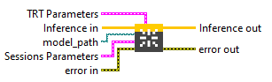
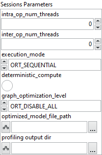
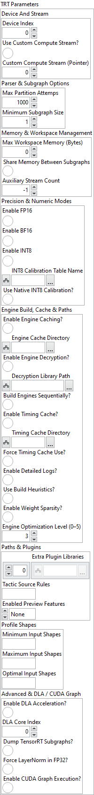

<h1>TensorRT</h1>

<h3>Description</h3>

Create Cuda Session with its Session Options on the stored local Env. Type : <em><strong>polymorphic</strong><strong>.</strong></em>

<h3>Input parameters</h3>

<table>
  <tbody>
    <tr>
      <td width="64" valign="top"></td>
      <td valign="top"><strong> Inference in : <em>object, </em></strong>inference session.</td>
    </tr>
    <tr>
      <td width="64" valign="top"></td>
      <td valign="top"><strong> model_path : <em>path, </em></strong>is the path to the model file.</td>
    </tr>
  </tbody>
</table>

<table>
  <tbody>
    <tr>
      <td valign="top" width="70%"><table>
  <tbody>
    <tr>
      <td width="64" valign="top"></td>
      <td valign="top"><strong>Sessions Parameters : <i>cluster</i></strong></td>
    </tr>
    <tr>
      <td></td>
      <td valign="top"><table>
  <tbody>
    <tr>
      <td width="64" valign="top"></td>
      <td valign="top"><strong>intra_op_num_threads : <i>integer, </i></strong>number of threads used within each operator to parallelize computations. If the value is 0, ONNX Runtime automatically uses the number of physical CPU cores.</td>
    </tr>
    <tr>
      <td width="64" valign="top"></td>
      <td valign="top"><strong>inter_op_num_threads : <i>integer, </i></strong>number of threads used between operators, to execute multiple graph nodes in parallel. If set to 0, this parameter is ignored when <code>execution_mode</code> is <code>ORT_SEQUENTIAL</code>. In <code>ORT_PARALLEL</code> mode, 0 means ORT automatically selects a suitable number of threads (usually equal to the number of cores).</td>
    </tr>
    <tr>
      <td width="64" valign="top"></td>
      <td valign="top"><strong>execution_mode : <em>enum</em>, </strong>controls whether the graph executes nodes one after another or allows parallel execution when possible<strong>.</strong><code>ORT_SEQUENTIAL</code> runs nodes in order, <code>ORT_PARALLEL</code> runs them concurrently.</td>
    </tr>
    <tr>
      <td width="64" valign="top"></td>
      <td valign="top">deterministic_compute : <em>boolean, </em>forces deterministic execution, meaning results will always be identical for the same inputs.</td>
    </tr>
    <tr>
      <td width="64" valign="top"></td>
      <td valign="top"><strong>graph_optimization_level : <em>enum</em>, </strong>defines how much ONNX Runtime optimizes the computation graph before running the model.</td>
    </tr>
    <tr>
      <td width="64" valign="top"></td>
      <td valign="top">optimized_model_file_path : <em>path</em>, file path to save the optimized model after graph analysis.</td>
    </tr>
    <tr>
      <td width="64" valign="top"></td>
      <td valign="top"><strong> profiling output dir : <em>path</em>, </strong>specifies the directory where ONNX Runtime will save profiling output files. If you set this parameter to a valid (non-empty) path, profiling is automatically enabled. However, if the path is empty, profiling will not be activated.</td>
    </tr>
  </tbody>
</table></td>
    </tr>
  </tbody>
</table></td>
      <td valign="top" width="30%">

</td>
    </tr>
  </tbody>
</table>

<table>
  <tbody>
    <tr>
      <td valign="top" width="70%"><table>
  <tbody>
    <tr>
      <td width="64" valign="top"></td>
      <td valign="top"><strong>TRT Parameters : <i>cluster</i></strong></td>
    </tr>
    <tr>
      <td></td>
      <td valign="top"><table>
  <tbody>
    <tr>
      <td width="64" valign="top"></td>
      <td valign="top"><strong>Device And Stream : <i>cluster,</i></strong></td>
    </tr>
    <tr>
      <td></td>
      <td valign="top"><table>
  <tbody>
    <tr>
      <td width="64" valign="top"></td>
      <td valign="top"><strong>Device Index :</strong><em><strong> integer,</strong></em> ID of the GPU used for inference (default = 0).</td>
    </tr>
    <tr>
      <td width="64" valign="top"></td>
      <td valign="top"><strong>Use Custom Compute Stream? : <em>boolean,</em></strong> if true, uses a user-defined CUDA compute stream instead of the default stream.</td>
    </tr>
    <tr>
      <td width="64" valign="top"></td>
      <td valign="top"><strong>Custom Compute Stream (Pointer) : <em>integer,</em></strong> pointer or reference to the user’s CUDA stream to be used during inference.</td>
    </tr>
  </tbody>
</table></td>
    </tr>
    <tr>
      <td width="64" valign="top"></td>
      <td valign="top"><strong>Parser &amp; Subgraph Options : <i>cluster,</i></strong></td>
    </tr>
    <tr>
      <td></td>
      <td valign="top"><table>
  <tbody>
    <tr>
      <td width="64" valign="top"></td>
      <td valign="top"><strong>Max Partition Attemps :</strong><em><strong> integer,</strong></em> maximum number of attempts for TensorRT to partition and identify compatible subgraphs within the ONNX model.</td>
    </tr>
    <tr>
      <td width="64" valign="top"></td>
      <td valign="top"><strong>Minimum Subgraph Size :</strong><em><strong> integer,</strong></em> minimum number of nodes required in a subgraph before TensorRT can take ownership of it.</td>
    </tr>
  </tbody>
</table></td>
    </tr>
    <tr>
      <td width="64" valign="top"></td>
      <td valign="top"><strong>Memory &amp; Workspace Management : <i>cluster,</i></strong></td>
    </tr>
    <tr>
      <td></td>
      <td valign="top"><table>
  <tbody>
    <tr>
      <td width="64" valign="top"></td>
      <td valign="top"><strong>Max Workspace Memory (Bytes) : <em>integer,</em></strong> maximum workspace memory allocated for TensorRT (0 = use maximum available GPU memory).</td>
    </tr>
    <tr>
      <td width="64" valign="top"></td>
      <td valign="top"><strong>Share Memory Between Subgraphs : <em>boolean,</em></strong> if true, allows multiple TensorRT subgraphs to reuse the same execution context and memory buffers.</td>
    </tr>
    <tr>
      <td width="64" valign="top"></td>
      <td valign="top"><strong>Auxiliary Stream Count :</strong><em><strong> integer,</strong></em> defines how many auxiliary CUDA streams are created per main inference stream.
<ul>
<li>
<ul>
<li>
<ul>
<li>
<ul>
<li>-1 = automatic heuristic mode</li>
<li>0 = minimize memory usage</li>
<li>&gt;0 = allow multiple auxiliary streams for parallel execution</li>
</ul>
</li>
</ul>
</li>
</ul>
</li>
</ul></td>
    </tr>
  </tbody>
</table></td>
    </tr>
    <tr>
      <td width="64" valign="top"></td>
      <td valign="top"><strong>Precision &amp; Numeric Modes</strong> <strong>: <i>cluster,</i></strong></td>
    </tr>
    <tr>
      <td></td>
      <td valign="top"><table>
  <tbody>
    <tr>
      <td width="64" valign="top"></td>
      <td valign="top"><strong>Enable FP16 : <em>boolean,</em></strong> enables half-precision (float16) computation for faster performance on supported GPUs.</td>
    </tr>
    <tr>
      <td width="64" valign="top"></td>
      <td valign="top"><strong>Enable BF16 : <em>boolean,</em></strong> enables bfloat16 precision for models trained in BF16 format.</td>
    </tr>
    <tr>
      <td width="64" valign="top"></td>
      <td valign="top"><strong>Enable INT8 : <em>boolean,</em></strong> enables INT8 quantization for maximum inference speed.</td>
    </tr>
    <tr>
      <td width="64" valign="top"></td>
      <td valign="top"><strong>INT8 Calibration Table Name : <em>path,</em></strong> specifies the name or path of the calibration table used for INT8 mode.</td>
    </tr>
    <tr>
      <td width="64" valign="top"></td>
      <td valign="top"><strong>Use Native INT8 Calibration? : <em>boolean,</em></strong> if true, uses the calibration table generated directly by TensorRT.</td>
    </tr>
  </tbody>
</table></td>
    </tr>
    <tr>
      <td width="64" valign="top"></td>
      <td valign="top"><strong>Engine Build, Cache &amp; Paths</strong> <strong>: <i>cluster,</i></strong></td>
    </tr>
    <tr>
      <td></td>
      <td valign="top"><table>
  <tbody>
    <tr>
      <td width="64" valign="top"></td>
      <td valign="top"><strong>Enable Engine Caching? : <em>boolean,</em></strong> saves compiled TensorRT engines to disk to avoid rebuilding on future runs.</td>
    </tr>
    <tr>
      <td width="64" valign="top"></td>
      <td valign="top"><strong>Engine Cache Directory : <em>path,</em></strong> path where the TensorRT engine cache will be stored.</td>
    </tr>
    <tr>
      <td width="64" valign="top"></td>
      <td valign="top"><strong>Enable Engine Decryption? : <em>boolean,</em></strong> enables support for encrypted engine files.</td>
    </tr>
    <tr>
      <td width="64" valign="top"></td>
      <td valign="top"><strong>Decryption Library Path : <em>path,</em></strong> path to the library used to decrypt TensorRT engine files.</td>
    </tr>
    <tr>
      <td width="64" valign="top"></td>
      <td valign="top"><strong>Build Engines Sequentially? : <em>boolean,</em></strong> forces TensorRT to build engines one at a time instead of in parallel.</td>
    </tr>
    <tr>
      <td width="64" valign="top"></td>
      <td valign="top"><strong>Enable Timing Cache? : <em>boolean,</em></strong> enables TensorRT’s timing cache to accelerate repeated builds.</td>
    </tr>
    <tr>
      <td width="64" valign="top"></td>
      <td valign="top"><strong>Timing Cache Directory : <em>path,</em></strong> path where timing cache data will be stored.</td>
    </tr>
    <tr>
      <td width="64" valign="top"></td>
      <td valign="top"><strong>Force Timing Cache Use? : <em>boolean,</em></strong> forces the reuse of the timing cache even if the device profile has changed.</td>
    </tr>
    <tr>
      <td width="64" valign="top"></td>
      <td valign="top"><strong>Enable Detailed Logs? : <em>boolean,</em></strong> enables detailed logging for each build step and timing stage.</td>
    </tr>
    <tr>
      <td width="64" valign="top"></td>
      <td valign="top"><strong>Use Build Heuristics? : <em>boolean,</em></strong> uses heuristic algorithms to reduce engine build time (may affect optimal performance).</td>
    </tr>
    <tr>
      <td width="64" valign="top"></td>
      <td valign="top"><strong>Enable Weight Sparsity? : <em>boolean,</em></strong> allows TensorRT to exploit sparsity in model weights for better performance.</td>
    </tr>
    <tr>
      <td width="64" valign="top"></td>
      <td valign="top"><strong>Engine Optimization Level (0–5)) : <em>integer,</em></strong> controls the engine builder optimization level.
<ul>
<li>
<ul>
<li>
<ul>
<li>
<ul>
<li>0–2 = fast build, reduced performance</li>
<li>3 = default balance between speed and quality</li>
<li>4–5 = best performance, longer build time</li>
</ul>
</li>
</ul>
</li>
</ul>
</li>
</ul></td>
    </tr>
  </tbody>
</table></td>
    </tr>
    <tr>
      <td width="64" valign="top"></td>
      <td valign="top"><strong>Paths &amp; Plugins</strong> <strong>: <i>cluster,</i></strong></td>
    </tr>
    <tr>
      <td></td>
      <td valign="top"><table>
  <tbody>
    <tr>
      <td width="64" valign="top"></td>
      <td valign="top"><strong>Extra Plugin Libraries : <em>array,</em></strong> list (semicolon-separated) of additional plugin library paths to load.</td>
    </tr>
    <tr>
      <td width="64" valign="top"></td>
      <td valign="top"><strong>Tactic Source Rules : <em>string,</em></strong> defines which tactic sources TensorRT should include or exclude (e.g. “-CUDNN,+CUBLAS”).</td>
    </tr>
    <tr>
      <td width="64" valign="top"></td>
      <td valign="top"><strong>Enabled Preview Features : <em>enum,</em></strong> comma-separated list of experimental TensorRT features to enable (e.g. “ALIASED_PLUGIN_IO_10_03”).</td>
    </tr>
  </tbody>
</table></td>
    </tr>
    <tr>
      <td width="64" valign="top"></td>
      <td valign="top"><strong>Profile Shapes</strong> <strong>: <i>cluster,</i></strong></td>
    </tr>
    <tr>
      <td></td>
      <td valign="top"><table>
  <tbody>
    <tr>
      <td width="64" valign="top"></td>
      <td valign="top"><strong>Minimum Input Shapes : <em>string,</em></strong> specifies the smallest input dimensions used to build the TensorRT engine.</td>
    </tr>
    <tr>
      <td width="64" valign="top"></td>
      <td valign="top"><strong>Maximum Input Shapes : <em>string,</em></strong> specifies the “typical” input size that TensorRT will optimize for.</td>
    </tr>
    <tr>
      <td width="64" valign="top"></td>
      <td valign="top"><strong>Optimal Input Shapes : <em>string,</em></strong> defines the upper bound for dynamic input dimensions accepted by the engine.</td>
    </tr>
  </tbody>
</table></td>
    </tr>
    <tr>
      <td width="64" valign="top"></td>
      <td valign="top"><strong>Advanced &amp; DLA / CUDA Graph : <i>cluster,</i></strong></td>
    </tr>
    <tr>
      <td></td>
      <td valign="top"><table>
  <tbody>
    <tr>
      <td width="64" valign="top"></td>
      <td valign="top"><strong>Enable DLA Acceleration? : <em>boolean,</em></strong> enables inference execution on NVIDIA’s Deep Learning Accelerator (if supported).</td>
    </tr>
    <tr>
      <td width="64" valign="top"></td>
      <td valign="top"><strong>DLA Core Index :</strong><em><strong> integer,</strong></em> selects which DLA core to use (0 = default).</td>
    </tr>
    <tr>
      <td width="64" valign="top"></td>
      <td valign="top"><strong>Dump TensorRT Subgraphs? : <em>boolean,</em></strong> dumps all TensorRT-compiled subgraphs to disk for debugging.</td>
    </tr>
    <tr>
      <td width="64" valign="top"></td>
      <td valign="top"><strong>Force LayerNorm in FP32? : <em>boolean,</em></strong> forces LayerNorm operations to run in full precision (FP32) for numerical stability.</td>
    </tr>
    <tr>
      <td width="64" valign="top"></td>
      <td valign="top"><strong>Enable CUDA Graph Execution? : <em>boolean,</em></strong> executes the TensorRT engine using CUDA Graph for improved launch efficiency.</td>
    </tr>
  </tbody>
</table></td>
    </tr>
  </tbody>
</table></td>
    </tr>
  </tbody>
</table></td>
      <td valign="top" width="30%">

</td>
    </tr>
  </tbody>
</table>

<h3>Output parameters</h3>

<table>
  <tbody>
    <tr>
      <td width="64" valign="top"></td>
      <td valign="top"><strong>Inference out</strong> <strong>: <em>object, </em></strong>inference session.</td>
    </tr>
  </tbody>
</table>

<h2>Example</h2>

All these exemples are snippets PNG, you can drop these Snippet onto the block diagram and get the depicted code added to your VI (Do not forget to install Accelerator library to run it).

