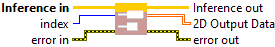

<h1>2D</h1>

<h2>Description</h2>

Retrieve Multi 2D Output Data (Bool, Int/UInt, Float, or String) (Inference Session). Type : <em><strong>polymorphic</strong><strong>.</strong></em>

<h3>Input parameters</h3>

<table>
  <tbody>
    <tr>
      <td width="64" valign="top"></td>
      <td valign="top"><strong>Inference in</strong> <strong>: <em>object, </em></strong>inference session.</td>
    </tr>
    <tr>
      <td width="64" valign="top"></td>
      <td valign="top"><strong>index : </strong><i><strong>integer</strong></i><strong>,</strong> defines the position of the output within the data array. It corresponds to the index assigned to the output when it is created (via the <i>index</i> parameter).</td>
    </tr>
  </tbody>
</table>

<h3>Output parameters</h3>

<table>
  <tbody>
    <tr>
      <td width="64" valign="top"></td>
      <td valign="top"><strong>Inference out</strong> <strong>: <em>object, </em></strong>inference session.</td>
    </tr>
    <tr>
      <td width="64" valign="top"></td>
      <td valign="top"><strong>2D Output Data : <em>array</em>, </strong>2D array of data with any type : integers (signed/unsigned), floats, doubles, booleans, or strings.​</td>
    </tr>
  </tbody>
</table>

<h2>Example</h2>

All these exemples are snippets PNG, you can drop these Snippet onto the block diagram and get the depicted code added to your VI (Do not forget to install Accelerator library to run it).

