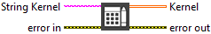

<h1>Build Kernel</h1>

<h2>Description</h2>

Constructs a convolution matrix by converting a string. This string can represent either integers or floating-point values. Type : <em><strong>polymorphic</strong><strong>.</strong></em>

<h3>Input parameters</h3>

<table>
  <tbody>
    <tr>
      <td width="64" valign="top"></td>
      <td valign="top"><strong>String Kernel : <em>string, </em></strong>string listing the coefficients that form the matrix with values separated by “<strong>,</strong>“, “<strong>;</strong>” or “<strong>space</strong>“.</td>
    </tr>
  </tbody>
</table>

<h3>Output parameters</h3>

<table>
  <tbody>
    <tr>
      <td width="64" valign="top"></td>
      <td valign="top"><strong>Kernel : <em>array, </em></strong>is the resulting matrix converted from the input string.</td>
    </tr>
  </tbody>
</table>

<h2>Examples</h2>

All these examples are snippets PNG, you can drop these Snippet onto the block diagram and get the depicted code added to your VI (Do not forget to install Computer Vision ​library to run it).

