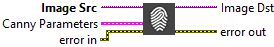
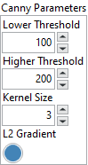

<h1>Canny Edge Detection</h1>

<h2>Description</h2>

Uses a specialized edge detection method to accurately estimate the location of edges even under conditions of poor signal-to-noise ratios. Type : <em><strong>polymorphic</strong><strong>.</strong></em>

<h3>Input parameters</h3>

<table>
  <tbody>
    <tr>
      <td width="64" valign="top"></td>
      <td valign="top"><strong>Image Src : <em>class, </em></strong>type accepted<strong> U8 </strong>and<strong> I16.</strong></td>
    </tr>
  </tbody>
</table>

<table>
  <tbody>
    <tr>
      <td valign="top" width="70%"><table>
  <tbody>
    <tr>
      <td width="64" valign="top"></td>
      <td valign="top"><strong>Canny Parameters :<em> cluster,</em></strong></td>
    </tr>
    <tr>
      <td></td>
      <td valign="top"><table>
  <tbody>
    <tr>
      <td width="64" valign="top"></td>
      <td valign="top"><strong>Lower Threshold : <em>float, </em></strong>first threshold for the hysteresis procedure.</td>
    </tr>
    <tr>
      <td width="64" valign="top"></td>
      <td valign="top"><strong>Higher Threshold : <em>float, </em></strong>second threshold for the hysteresis procedure.</td>
    </tr>
    <tr>
      <td width="64" valign="top"></td>
      <td valign="top">Kernel Size<em> : integer, </em>aperture size for the Sobel operator.</td>
    </tr>
    <tr>
      <td width="64" valign="top"></td>
      <td valign="top"><strong>L2 Gradient : <em>boolean, </em></strong>a flag, indicating whether a more accurate L2 norm should be used to calculate the image gradient magnitude ( L2gradient=true ), or whether the default L1 norm is enough ( L2gradient=false ).</td>
    </tr>
  </tbody>
</table></td>
    </tr>
  </tbody>
</table></td>
      <td valign="top" width="30%">

</td>
    </tr>
  </tbody>
</table>

<h3>Output parameters</h3>

<table>
  <tbody>
    <tr>
      <td width="64" valign="top"></td>
      <td valign="top"><strong>Image Dst :<em> class</em></strong></td>
    </tr>
  </tbody>
</table>

<h2>Examples</h2>

All these examples are snippets PNG, you can drop these Snippet onto the block diagram and get the depicted code added to your VI (Do not forget to install Computer Vision ​library to run it).

