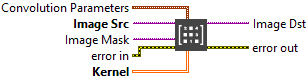
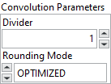

<h1>Covolute</h1>

<h2>Description</h2>

Filters an image using a linear filter. Type : <em><strong>polymorphic</strong><strong>.</strong></em>

<h3>Input parameters</h3>

<table>
  <tbody>
    <tr>
      <td width="64" valign="top"></td>
      <td valign="top"><strong>Image Src : <em>class, </em></strong>type accepted <strong>U8, I16, RGB </strong>and <strong>HSL.</strong></td>
    </tr>
    <tr>
      <td width="64" valign="top"></td>
      <td valign="top">Image Mask : <em>class, </em>type accepted <strong>U8, I16, RGB </strong>and <strong>HSL.</strong></td>
    </tr>
    <tr>
      <td width="64" valign="top"></td>
      <td valign="top">Kernel :<em> array, </em>2D array that contains the convolution matrix to apply to the image. The size of the convolution is fixed by the size of this array. The array can be generated by standard LabVIEW programming techniques or the <a href="../get-kernel/README.md">Get Kernel</a> or the <a href="../build-kernel/README.md">Build Kernel</a> function. If the kernel contains fewer than three rows or three columns, no convolution is performed.</td>
    </tr>
  </tbody>
</table>

<table>
  <tbody>
    <tr>
      <td valign="top" width="70%"><table>
  <tbody>
    <tr>
      <td width="64" valign="top"></td>
      <td valign="top"><strong>Convolution Parameters :<em> cluster,</em></strong></td>
    </tr>
    <tr>
      <td></td>
      <td valign="top"><table>
  <tbody>
    <tr>
      <td width="64" valign="top"></td>
      <td valign="top"><strong>Divider<em> : integer, </em></strong>normalization factor that can be applied to the sum of the obtained products. Under normal conditions the divider should not be connected. If connected and not equal to 0, the elements internal to the matrix are summed and then divided by this normalization factor.</td>
    </tr>
    <tr>
      <td width="64" valign="top"></td>
      <td valign="top"><strong>Rounding Mode : <em>enum, </em></strong>specifies the type of rounding to use when dividing image pixels.
<ul>
<li>
<ul>
<li>
<ul>
<li>OPTIMIZED : rounds the result of a division using the best available method</li>
<li>TRUNCATE : truncates the result of a division</li>
</ul>
</li>
</ul>
</li>
</ul></td>
    </tr>
  </tbody>
</table></td>
    </tr>
  </tbody>
</table></td>
      <td valign="top" width="30%">

</td>
    </tr>
  </tbody>
</table>

<h3>Output parameters</h3>

<table>
  <tbody>
    <tr>
      <td width="64" valign="top"></td>
      <td valign="top"><strong>Image Dst :<em> class</em></strong></td>
    </tr>
  </tbody>
</table>

<h2>Examples</h2>

All these examples are snippets PNG, you can drop these Snippet onto the block diagram and get the depicted code added to your VI (Do not forget to install Computer Vision ​library to run it).

