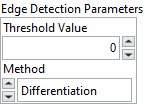

<h1>Edge Detection</h1>

<h2>Description</h2>

Extracts the contours (detects edges) in gray-level values. Type : <em><strong>polymorphic</strong><strong>.</strong></em>

<h3>Input parameters</h3>

<table>
  <tbody>
    <tr>
      <td width="64" valign="top"></td>
      <td valign="top"><strong>Image Src : <em>class, </em></strong>type accepted<strong> U8 </strong>and <strong>I16.</strong></td>
    </tr>
    <tr>
      <td width="64" valign="top"></td>
      <td valign="top">Image Mask : <em>class, </em>type accepted<strong> U8 </strong>and <strong>I16.</strong></td>
    </tr>
  </tbody>
</table>

<table>
  <tbody>
    <tr>
      <td valign="top" width="70%"><table>
  <tbody>
    <tr>
      <td width="64" valign="top"></td>
      <td valign="top"><strong>Edge Detection Parameters :<em> cluster,</em></strong></td>
    </tr>
    <tr>
      <td></td>
      <td valign="top"><table>
  <tbody>
    <tr>
      <td width="64" valign="top"></td>
      <td valign="top"><strong>Threshold Value :<em> integer, </em></strong>minimum pixel value to appear in the resulting image. It is rare to use a value greater than 0 for this type of processing because the results from this processing are usually very dark and are not very dynamic.</td>
    </tr>
    <tr>
      <td width="64" valign="top"></td>
      <td valign="top"><strong>Method : <em>enum, </em></strong>specifies the type of edge-detection filter to use.
<ul>
<li>
<ul>
<li>
<ul>
<li>Differentiation : processing with a 2 × 2 matrix</li>
<li>Gradient : processing with a 2 × 2 matrix</li>
<li>Prewitt : processing with a 3 × 3 matrix</li>
<li>Roberts : processing with a 2 × 2 matrix</li>
<li>Sigma : processing with a 3 × 3 matrix</li>
<li>Sobel : processing with a 3 × 3 matrix</li>
</ul>
</li>
</ul>
</li>
</ul></td>
    </tr>
  </tbody>
</table></td>
    </tr>
  </tbody>
</table></td>
      <td valign="top" width="30%">

</td>
    </tr>
  </tbody>
</table>

<h3>Output parameters</h3>

<table>
  <tbody>
    <tr>
      <td width="64" valign="top"></td>
      <td valign="top"><strong>Image Dst :<em> class</em></strong></td>
    </tr>
  </tbody>
</table>

<h2>Examples</h2>

All these examples are snippets PNG, you can drop these Snippet onto the block diagram and get the depicted code added to your VI (Do not forget to install Computer Vision ​library to run it).

