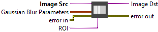
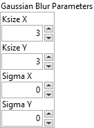

<h1>Gaussian Blur</h1>

<h2>Description</h2>

Blurs an image using a Gaussian filter. The function convolves the source image with the specified Gaussian kernel. Type : <em><strong>polymorphic</strong><strong>.</strong></em>

<h3>Input parameters</h3>

<table>
  <tbody>
    <tr>
      <td width="64" valign="top"></td>
      <td valign="top"><strong>Image Src : <em>class, </em></strong>type accepted <strong>U8</strong>, <strong>I16</strong>, <strong>RGB</strong> and <strong>HSL.</strong></td>
    </tr>
    <tr>
      <td width="64" valign="top"></td>
      <td valign="top">ROI : <em>class, </em>if ROI is wired we apply blur only on ROI pixel different of 0 (type accepted <strong>U8</strong>, <strong>I16</strong>, <strong>RGB</strong> and <strong>HSL</strong>).</td>
    </tr>
  </tbody>
</table>

<table>
  <tbody>
    <tr>
      <td valign="top" width="70%"><table>
  <tbody>
    <tr>
      <td width="64" valign="top"></td>
      <td valign="top"><strong>Gaussian Blur Parameters :<em> cluster,</em></strong></td>
    </tr>
    <tr>
      <td></td>
      <td valign="top"><table>
  <tbody>
    <tr>
      <td width="64" valign="top"></td>
      <td valign="top"><strong>ksize_x :</strong> integer, gaussian kernel width.</td>
    </tr>
    <tr>
      <td width="64" valign="top"></td>
      <td valign="top">ksize_y : integer, gaussian kernel height.</td>
    </tr>
    <tr>
      <td width="64" valign="top"></td>
      <td valign="top">sigma_x :<em> float, </em>gaussian kernel standard deviation in X direction.</td>
    </tr>
    <tr>
      <td width="64" valign="top"></td>
      <td valign="top">sigma_y :<em> float, </em>gaussian kernel standard deviation in Y direction.</td>
    </tr>
  </tbody>
</table></td>
    </tr>
  </tbody>
</table>

ksize_x and ksize_y can differ but they both must be positive and odd. Or, they can be zero’s and then they are computed from sigma.

If sigma_y is zero, it is set to be equal to sigma_x, if both sigmas are zeros, they are computed from ksize_x and ksize_y, respectively to fully control the result regardless of possible future modifications of all this semantics, it is recommended to specify all of ksize_x, ksize_y, sigma_x, and sigma_y.
</td>
      <td valign="top" width="30%">

</td>
    </tr>
  </tbody>
</table>

<h3>Output parameters</h3>

<table>
  <tbody>
    <tr>
      <td width="64" valign="top"></td>
      <td valign="top"><strong>Image Dst :<em> class</em></strong></td>
    </tr>
  </tbody>
</table>

<h2>Examples</h2>

All these examples are snippets PNG, you can drop these Snippet onto the block diagram and get the depicted code added to your VI (Do not forget to install Computer Vision ​library to run it).

