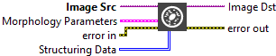
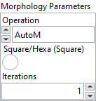

<h1>Morphology</h1>

<h2>Description</h2>

Performs primary morphological transformations. Type : <em><strong>polymorphic</strong><strong>.</strong></em>

<h3>Input parameters</h3>

<table>
  <tbody>
    <tr>
      <td width="64" valign="top"></td>
      <td valign="top"><strong>Image Src : <em>class, </em></strong>type accepted <strong>U8</strong>.</td>
    </tr>
    <tr>
      <td width="64" valign="top"></td>
      <td valign="top">Structuring Data :<em> array, </em>2D array that contains the structuring element to apply to the image. The size of the structuring element (the size of this array) determines the processing size. A structuring element of 3 × 3 is used if this input is not connected.</td>
    </tr>
  </tbody>
</table>

<table>
  <tbody>
    <tr>
      <td valign="top" width="70%"><table>
  <tbody>
    <tr>
      <td width="64" valign="top"></td>
      <td valign="top"><strong>Morphology</strong> <strong>Parameters :<em> cluster,</em></strong></td>
    </tr>
    <tr>
      <td></td>
      <td valign="top"><table>
  <tbody>
    <tr>
      <td width="64" valign="top"></td>
      <td valign="top"><strong>Operation : <em>enum, </em></strong>specifies the type of morphological transformation procedure to use.
<ul>
<li>
<ul>
<li>
<ul>
<li>AutoM : auto median</li>
<li>Close : dilation followed by an erosion</li>
<li>Dilate : dilation (the opposite of an erosion)</li>
<li>Erode : erosion that eliminates isolated background pixels</li>
<li>Gradient : extraction of internal and external contours of a particle</li>
<li>Gradient out : extraction of exterior contours of a particle</li>
<li>Gradient in : extraction of interior contours of a particle</li>
<li>Hit miss : elimination of all pixels that do not have the same pattern as found in the structuring element</li>
<li>Open : erosion followed by a dilation</li>
<li>PClose : a succession of seven closings and openings</li>
<li>POpen : a succession of seven openings and closings</li>
<li>Thick : activation of all pixels matching the pattern in the structuring element</li>
<li>Thin : activation of all pixels matching the pattern in the structuring element</li>
</ul>
</li>
</ul>
</li>
</ul></td>
    </tr>
    <tr>
      <td width="64" valign="top"></td>
      <td valign="top"><strong>Square/Hexa (Square) :<em> boolean, </em></strong>specifies whether to treat the pixel frame as square or hexagonal during the transformation.</td>
    </tr>
    <tr>
      <td width="64" valign="top"></td>
      <td valign="top">Iteration :<em> integer, </em>is the number of times the VI performs a dilate or erode operation.</td>
    </tr>
  </tbody>
</table></td>
    </tr>
  </tbody>
</table></td>
      <td valign="top" width="30%">

</td>
    </tr>
  </tbody>
</table>

<h3>Output parameters</h3>

<table>
  <tbody>
    <tr>
      <td width="64" valign="top"></td>
      <td valign="top"><strong>Image Dst :<em> class</em></strong></td>
    </tr>
  </tbody>
</table>

<h2>Examples</h2>

All these examples are snippets PNG, you can drop these Snippet onto the block diagram and get the depicted code added to your VI (Do not forget to install Computer Vision ​library to run it).

