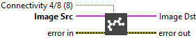

<h1>Reject Border</h1>

<h2>Description</h2>

Eliminates particles that touch the border of an image. The source image must be an 8-bit binary image. Type : <em><strong>polymorphic</strong><strong>.</strong></em>

<h3>Input parameters</h3>

<table>
  <tbody>
    <tr>
      <td width="64" valign="top"></td>
      <td valign="top"><strong>Image Src : <em>class, </em></strong>type accepted <strong>U8</strong>.</td>
    </tr>
    <tr>
      <td width="64" valign="top"></td>
      <td valign="top">Connectivity 4/8 (8) :<em> boolean, </em>specifies how the algorithm determines whether an adjacent pixel belongs to the same or to a different particle.</td>
    </tr>
  </tbody>
</table>

<h3>Output parameters</h3>

<table>
  <tbody>
    <tr>
      <td width="64" valign="top"></td>
      <td valign="top"><strong>Image Dst : <em>class</em></strong></td>
    </tr>
  </tbody>
</table>

<h2>Examples</h2>

All these examples are snippets PNG, you can drop these Snippet onto the block diagram and get the depicted code added to your VI (Do not forget to install Computer Vision ​library to run it).

