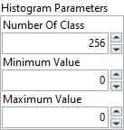
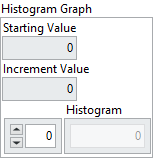

<h1>Histograph</h1>

<h2>Description</h2>

Calculates the histogram from an image. Type : <em><strong>polymorphic</strong><strong>.</strong></em>

<h3>Input parameters</h3>

<table>
  <tbody>
    <tr>
      <td width="64" valign="top"></td>
      <td valign="top"><strong>Image Src : <em>class, </em></strong>type accepted <strong>U8</strong> and <strong>I16</strong>.</td>
    </tr>
    <tr>
      <td width="64" valign="top"></td>
      <td valign="top"><strong>Image Mask : <em>class, </em></strong>type accepted <strong>U8</strong> and <strong>I16</strong>.</td>
    </tr>
  </tbody>
</table>

<table>
  <tbody>
    <tr>
      <td valign="top" width="70%"><table>
  <tbody>
    <tr>
      <td width="64" valign="top"></td>
      <td valign="top"><strong>Histogram Parameters : <em>cluster,</em></strong></td>
    </tr>
    <tr>
      <td></td>
      <td valign="top"><table>
  <tbody>
    <tr>
      <td width="64" valign="top"></td>
      <td valign="top"><strong>Number Of Class : <em>integer, </em></strong>specifies the number of classes used to classify the pixels. The number of obtained classes differs from the specified amount in a case in which the minimum and maximum boundaries are overshot in the interval range. It is advised to specify a number of classes that is a power of two (for example, 2, 4, or 8) for 8-bit or 16-bit images. The default value is 256, which is designed for 8-bit images. This value gives a uniform class distribution or one class for each grayscale intensity in an 8-bit image.</td>
    </tr>
    <tr>
      <td width="64" valign="top"></td>
      <td valign="top"><strong>Minimum Value : <em>float, </em></strong>minimum interval value.</td>
    </tr>
    <tr>
      <td width="64" valign="top"></td>
      <td valign="top"><strong>Maximum Value : <em>float, </em></strong>maximum interval value.</td>
    </tr>
  </tbody>
</table></td>
    </tr>
  </tbody>
</table></td>
      <td valign="top" width="30%">

</td>
    </tr>
  </tbody>
</table>

<h3>Output parameters</h3>

<table>
  <tbody>
    <tr>
      <td valign="top" width="70%"><table>
  <tbody>
    <tr>
      <td width="64" valign="top"></td>
      <td valign="top"><strong>Histogram Graph : <em>cluster, </em></strong>returns the histogram values.</td>
    </tr>
    <tr>
      <td></td>
      <td valign="top"><table>
  <tbody>
    <tr>
      <td width="64" valign="top"></td>
      <td valign="top"><strong>Starting Value : <em>float, </em></strong>returns the smallest pixel value from the first class calculated in the histogram. It can be equal to the Minimum value from the interval range or the smallest value found for the image type connected.</td>
    </tr>
    <tr>
      <td width="64" valign="top"></td>
      <td valign="top">Increment Value :<em> float, </em>returns the incrementing value that specifies how much to add to <strong>Starting Value</strong> in calculating the median value of each class from the histogram. The median value x<em>n</em> from the <em>n</em>th class is expressed as follows : x<em>n</em> = Starting Value + <em>n</em> × Incremental Value.</td>
    </tr>
    <tr>
      <td width="64" valign="top"></td>
      <td valign="top">Histogram :<em> array, </em>returns the histogram values in an array. The elements found in this array are the number of pixels per class. The <em>n</em>th class contains all pixel values belonging to the interval [(Starting Value + (<em>n</em> – 1) × Interval Width), (Starting Value + <em>n</em> × (Interval Width – 1))].</td>
    </tr>
  </tbody>
</table></td>
    </tr>
  </tbody>
</table>

<table>
  <tbody>
    <tr>
      <td width="64" valign="top"></td>
      <td valign="top"><strong>Mean Value : <em>float, </em></strong>returns the mean value of the pixels used in calculating the histogram.</td>
    </tr>
    <tr>
      <td width="64" valign="top"></td>
      <td valign="top"><strong>Std Dev : <em>float, </em></strong>returns the standard deviation from the histogram. The higher this value, the better the distribution of the values in the histogram and the image.</td>
    </tr>
  </tbody>
</table></td>
      <td valign="top" width="30%">

</td>
    </tr>
  </tbody>
</table>

<h2>Examples</h2>

All these examples are snippets PNG, you can drop these Snippet onto the block diagram and get the depicted code added to your VI (Do not forget to install Computer Vision ​library to run it).

