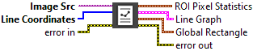
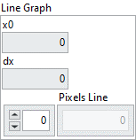
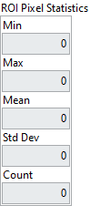
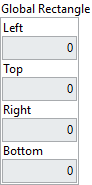

<h1>Line Profile</h1>

<h2>Description</h2>

Calculates the profile of a line of pixels. Type : <em><strong>polymorphic</strong><strong>.</strong></em>

<h3>Input parameters</h3>

<table>
  <tbody>
    <tr>
      <td width="64" valign="top"></td>
      <td valign="top"><strong>Image Src : <em>class, </em></strong>type accepted <strong>U8</strong> and <strong>I16</strong>.</td>
    </tr>
    <tr>
      <td width="64" valign="top"></td>
      <td valign="top"><strong>Line Coordinates : <em>array, </em></strong>specifying the pixel coordinates that form the end points of the line.</td>
    </tr>
  </tbody>
</table>

<h3>Output parameters</h3>

<table>
  <tbody>
    <tr>
      <td valign="top" width="70%"><table>
  <tbody>
    <tr>
      <td width="64" valign="top"></td>
      <td valign="top"><strong>Line Graph : <em>cluster, </em></strong>contains the line profile with an x-origin at 0 and an increment of 1.</td>
    </tr>
    <tr>
      <td></td>
      <td valign="top"><table>
  <tbody>
    <tr>
      <td width="64" valign="top"></td>
      <td valign="top"><strong>x0 : <em>integer, </em></strong>always returns 0.</td>
    </tr>
    <tr>
      <td width="64" valign="top"></td>
      <td valign="top">dx :<em> integer, </em>always returns 1.</td>
    </tr>
    <tr>
      <td width="64" valign="top"></td>
      <td valign="top">Pixels Line :<em> array, </em>returns the line profile calculated in an array in which elements represent the pixel values belonging to the specified vector.</td>
    </tr>
  </tbody>
</table></td>
    </tr>
  </tbody>
</table></td>
      <td valign="top" width="30%">

</td>
    </tr>
  </tbody>
</table>

<table>
  <tbody>
    <tr>
      <td valign="top" width="70%"><table>
  <tbody>
    <tr>
      <td width="64" valign="top"></td>
      <td valign="top"><strong>ROI Pixel Statistics : <em>cluster, </em></strong>contains relevant information about the pixels found in the specified vector.</td>
    </tr>
    <tr>
      <td></td>
      <td valign="top"><table>
  <tbody>
    <tr>
      <td width="64" valign="top"></td>
      <td valign="top"><strong>Min : <em>integer, </em></strong>returns the smallest pixel value found in the line profile.</td>
    </tr>
    <tr>
      <td width="64" valign="top"></td>
      <td valign="top">Max :<em> integer, </em>returns the largest pixel value found in the line profile.</td>
    </tr>
    <tr>
      <td width="64" valign="top"></td>
      <td valign="top">Mean :<em> float, </em>returns the mean value of the pixels found in the line profile.</td>
    </tr>
    <tr>
      <td width="64" valign="top"></td>
      <td valign="top">Std Dev :<em> float, </em>returns the standard deviation from the line profile.</td>
    </tr>
    <tr>
      <td width="64" valign="top"></td>
      <td valign="top">Count :<em> integer, </em>returns the number of pixels found in the line profile.</td>
    </tr>
  </tbody>
</table></td>
    </tr>
  </tbody>
</table></td>
      <td valign="top" width="30%">

</td>
    </tr>
  </tbody>
</table>

<table>
  <tbody>
    <tr>
      <td valign="top" width="70%"><table>
  <tbody>
    <tr>
      <td width="64" valign="top"></td>
      <td valign="top"><strong>Global Rectangle : <em>cluster, </em></strong>contains the coordinates of a bounding rectangle for the line in the image.</td>
    </tr>
    <tr>
      <td></td>
      <td valign="top"><table>
  <tbody>
    <tr>
      <td width="64" valign="top"></td>
      <td valign="top"><strong>Left : </strong>integer, indicates the x-coordinate of the top-left corner of the rectangle.</td>
    </tr>
    <tr>
      <td width="64" valign="top"></td>
      <td valign="top">Top : integer, indicates the y-coordinate of the top-left corner of the rectangle.</td>
    </tr>
    <tr>
      <td width="64" valign="top"></td>
      <td valign="top">Right : integer, indicates the x-coordinate of the bottom-right corner of the rectangle.</td>
    </tr>
    <tr>
      <td width="64" valign="top"></td>
      <td valign="top">Bottom : integer, indicates the y-coordinate of the bottom-right corner of the rectangle.</td>
    </tr>
  </tbody>
</table></td>
    </tr>
  </tbody>
</table></td>
      <td valign="top" width="30%">

</td>
    </tr>
  </tbody>
</table>

<h2>Examples</h2>

All these examples are snippets PNG, you can drop these Snippet onto the block diagram and get the depicted code added to your VI (Do not forget to install Computer Vision ​library to run it).

