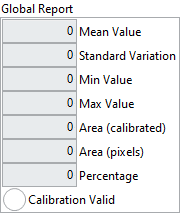
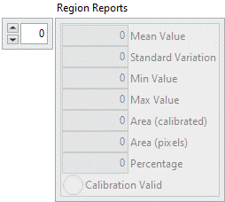

<h1>Quantify</h1>

<h2>Description</h2>

Quantifies the contents of an image or the regions within an image. The region definition is performed with a labeled image mask. Each region of the mask has a single unique value. Type : <em><strong>polymorphic</strong><strong>.</strong></em>

<h3>Input parameters</h3>

<table>
  <tbody>
    <tr>
      <td width="64" valign="top"></td>
      <td valign="top"><strong>Image Src : <em>class, </em></strong>type accepted <strong>U8</strong> and <strong>I16</strong>.</td>
    </tr>
    <tr>
      <td width="64" valign="top"></td>
      <td valign="top">Image Mask : <em>class, </em>type accepted <strong>U8</strong> and <strong>I16</strong>.</td>
    </tr>
  </tbody>
</table>

<h3>Output parameters</h3>

<table>
  <tbody>
    <tr>
      <td valign="top" width="70%"><table>
  <tbody>
    <tr>
      <td width="64" valign="top"></td>
      <td valign="top"><strong>Global Report : <em>cluster, </em></strong>contains the quantification data relative to all the regions within an image, or to the entire image if the <strong>Image Mask</strong> is not connected.</td>
    </tr>
    <tr>
      <td></td>
      <td valign="top"><table>
  <tbody>
    <tr>
      <td width="64" valign="top"></td>
      <td valign="top"><strong>Mean Value : <em>float, </em></strong>mean value of the pixels.</td>
    </tr>
    <tr>
      <td width="64" valign="top"></td>
      <td valign="top">Standard Variation : <em>float, </em>pixel values indicates the distribution of the values in relation to the average. The higher this value, the better the distribution of the pixel values.</td>
    </tr>
    <tr>
      <td width="64" valign="top"></td>
      <td valign="top">Min Value : <em>float, </em>returns the smallest pixel value.</td>
    </tr>
    <tr>
      <td width="64" valign="top"></td>
      <td valign="top">Max Value : <em>float, </em>returns the largest pixel value.</td>
    </tr>
    <tr>
      <td width="64" valign="top"></td>
      <td valign="top">Area (calibrated) : <em>float, </em>returns the analyzed surface area in user-defined units.</td>
    </tr>
    <tr>
      <td width="64" valign="top"></td>
      <td valign="top">Area (pixels) :<em> integer, </em>returns the analyzed surface area in pixels.</td>
    </tr>
    <tr>
      <td width="64" valign="top"></td>
      <td valign="top">Percentage :<em> float, </em>returns the percentage of the analyzed surface in relation to the complete image.</td>
    </tr>
    <tr>
      <td width="64" valign="top"></td>
      <td valign="top">Calibration Valid :<em> boolean, </em>indicates whether the calibration information is valid. If the calibration information is invalid for any of the regions, <strong>Calibration Valid</strong> boolean is false.</td>
    </tr>
  </tbody>
</table></td>
    </tr>
  </tbody>
</table></td>
      <td valign="top" width="30%">

</td>
    </tr>
  </tbody>
</table>

<table>
  <tbody>
    <tr>
      <td valign="top" width="70%"><table>
  <tbody>
    <tr>
      <td width="64" valign="top"></td>
      <td valign="top"><strong>Region Reports : <em>array, </em></strong>contains the quantification data relative to each region within an image. Each pixel in the image mask indicates, by its pixel value, to which region the corresponding pixel in the image belongs. The <em>n</em>th element in this array contains the data regarding the <em>n</em>th + 1 region. The size of this array is equal to 2Bit Depth – 1. If the <strong>Image Mask</strong> is not connected, this array is empty. The quantification data is still returned for the entire image in the <strong>Global Report</strong>.</td>
    </tr>
    <tr>
      <td></td>
      <td valign="top"><table>
  <tbody>
    <tr>
      <td width="64" valign="top"></td>
      <td valign="top"><strong>Mean Value : <em>float, </em></strong>mean value of the pixels.</td>
    </tr>
    <tr>
      <td width="64" valign="top"></td>
      <td valign="top">Standard Variation : <em>float, </em>pixel values indicates the distribution of the values in relation to the average. The higher this value, the better the distribution of the pixel values.</td>
    </tr>
    <tr>
      <td width="64" valign="top"></td>
      <td valign="top">Min Value : <em>float, </em>returns the smallest pixel value.</td>
    </tr>
    <tr>
      <td width="64" valign="top"></td>
      <td valign="top">Max Value : <em>float, </em>returns the largest pixel value.</td>
    </tr>
    <tr>
      <td width="64" valign="top"></td>
      <td valign="top">Area (calibrated) : <em>float, </em>returns the analyzed surface area in user-defined units.</td>
    </tr>
    <tr>
      <td width="64" valign="top"></td>
      <td valign="top">Area (pixels) :<em> integer, </em>returns the analyzed surface area in pixels.</td>
    </tr>
    <tr>
      <td width="64" valign="top"></td>
      <td valign="top">Percentage :<em> float, </em>returns the percentage of the analyzed surface in relation to the complete image.</td>
    </tr>
    <tr>
      <td width="64" valign="top"></td>
      <td valign="top">Calibration Valid :<em> boolean, </em>indicates whether the calibration information is valid. If the calibration information is invalid for any of the regions, <strong>Calibration Valid</strong> boolean is false.</td>
    </tr>
  </tbody>
</table></td>
    </tr>
  </tbody>
</table></td>
      <td valign="top" width="30%">

</td>
    </tr>
  </tbody>
</table>

<h2>Examples</h2>

All these examples are snippets PNG, you can drop these Snippet onto the block diagram and get the depicted code added to your VI (Do not forget to install Computer Vision ​library to run it).

