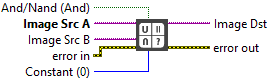

<h1>And</h1>

<h2>Description</h2>

Performs an AND or NAND operation on two images or an image and a constant. Type : <em><strong>polymorphic</strong><strong>.</strong></em>

<h3>Input parameters</h3>

<table>
  <tbody>
    <tr>
      <td width="64" valign="top"></td>
      <td valign="top"><strong>Image Src A : <em>class,</em></strong>type accepted <strong>U8</strong>, <strong>I16</strong>, <strong>RGB</strong> and <strong>HSL</strong>.</td>
    </tr>
    <tr>
      <td width="64" valign="top"></td>
      <td valign="top">Image Src B : <em>class,</em> type accepted <strong>U8</strong>, <strong>I16</strong>, <strong>RGB</strong> and <strong>HSL</strong>.</td>
    </tr>
    <tr>
      <td width="64" valign="top"></td>
      <td valign="top">Constant :<em> integer, </em>value used for image-constant operations. <strong>Constant</strong> must be a RGB color value when <strong>Image Src A</strong> is a color image.</td>
    </tr>
    <tr>
      <td width="64" valign="top"></td>
      <td valign="top">And/Nand (And) :<em> boolean, </em>specifies which logic operation the function performs. If set to TRUE, the result of the AND is inverted, producing a NAND. The default is FALSE, which specifies an AND operation.</td>
    </tr>
  </tbody>
</table>

<h3>Output parameters</h3>

<table>
  <tbody>
    <tr>
      <td width="64" valign="top"></td>
      <td valign="top"><strong>Image Dst : <em>class</em></strong></td>
    </tr>
  </tbody>
</table>

<h2>Examples</h2>

All these examples are snippets PNG, you can drop these Snippet onto the block diagram and get the depicted code added to your VI (Do not forget to install Computer Vision ​library to run it).

