<h1>Function resume</h1>

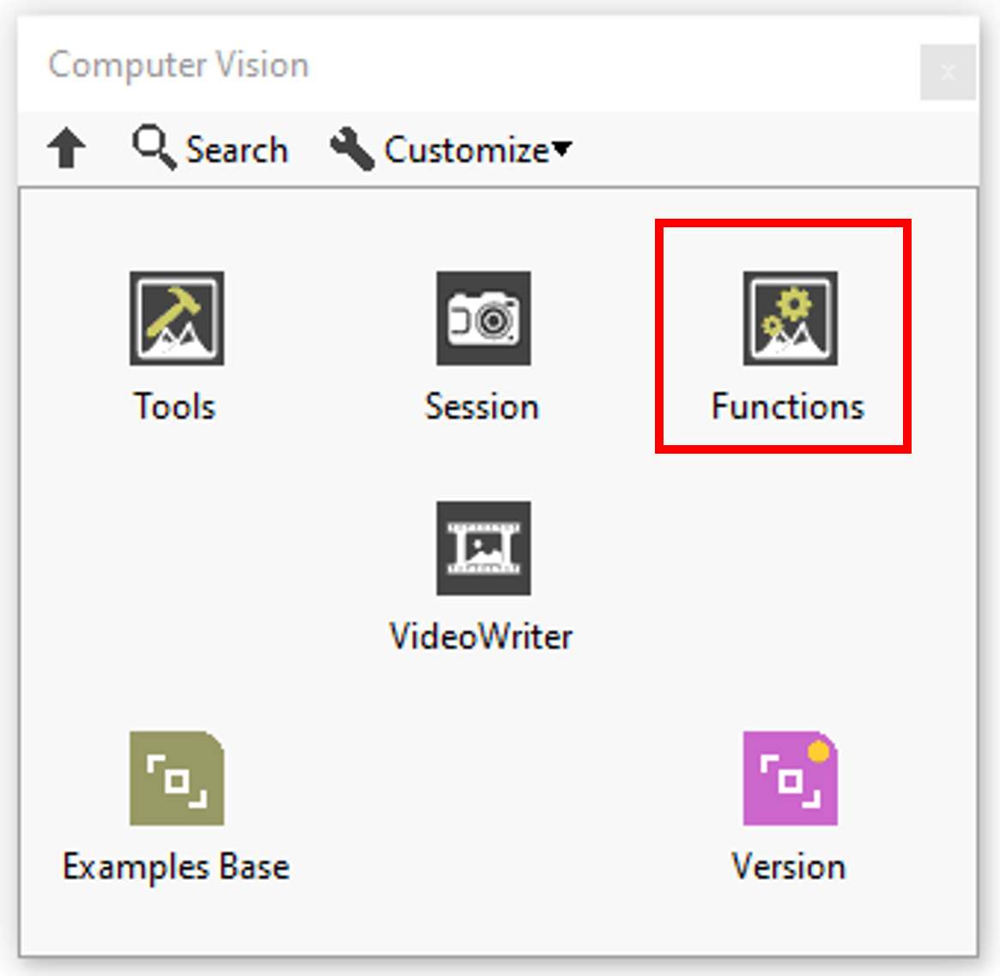

In this section you’ll find a list of function available.

|  | **ICONS** | **RESUME** |
| --- | --- | --- |
| [Build Kernel](../filters/build-kernel/README.md) |  | Constructs a convolution matrix by converting a string. |
| [Canny Edge Detection](../filters/canny-edge-detection/README.md) |  | Uses a specialized edge detection method to accurately estimate the location of edges even under conditions of poor signal-to-noise ratios. |
| [Convolute](../filters/convolute/README.md) |  | Filters an image using a linear filter. |
| [Edge Detection](../filters/edge-detection/README.md) | 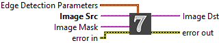 | Extracts the contours (detects edges) in gray-level values. |
| [Gaussian Blur](../filters/gaussian-blur/README.md) |  | Blurs an image using a Gaussian filter |
| [Get Kernel](../filters/get-kernel/README.md) | 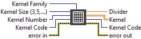 | Reads a predefined kernel. |
| [Fill Hole](../form/fill-hole/README.md) | 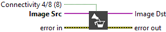 | Fills the holes found in a particle. |
| [Morphology](../form/morphology/README.md) |  | Performs primary morphological transformations. |
| [Particle Filter](../form/particle-filter/README.md) | 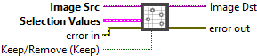 | Filters (keeps or removes) each particle in an image according to its measurements. |
| [Reject Border](../form/reject-border/README.md) |  | Eliminates particles that touch the border of an image. |
| [Remove Particle](../form/remove-particle/README.md) | 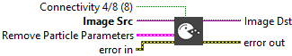 | Eliminates or keeps particles resistant to a specified number of 3 x 3 erosions. |
| [Histograph](../inspection/histograph/README.md) | 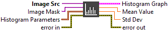 | Calculates the histogram from an image. |
| [Histogram](../inspection/histogram/README.md) | 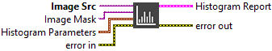 | Calculates the histogram of an image. |
| [Line Profile](../inspection/line-profile/README.md) |  | Calculates the profile of a line of pixels. |
| [Particle Analysis](../inspection/particle-analysis/README.md) | 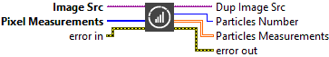 | Returns the number of particles detected in a binary image and a 2D array of requested measurements about the particle. |
| [Particle Analysis Report](../inspection/particle-analysis-report/README.md) | 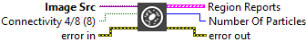 | Returns the number of particles detected in a binary image and an array of reports containing the most commonly used particle measurements. |
| [Quantify](../inspection/quantify/README.md) | 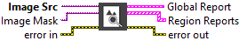 | Quantifies the contents of an image or the regions within an image. |
| [ROI Profile](../inspection/roi-profile/README.md) | 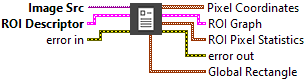 | Calculates the profile of the pixels along the boundary of an ROI descriptor. |
| [Detect Faces](../inspection/detect-faces/README.md) | 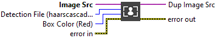 | Apply a haarscascades to detect faces then add rectangle around theses faces. |
| [Add](../../../_resolved/add/README.md) |  | Adds two images or an image and a constant. |
| [And](../../../_resolved/and/README.md) |  | Performs an AND or NAND operation on two images or an image and a constant. |
| [Compare](../operators/compare/README.md) | 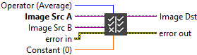 | Performs comparison operations between two images or an image and a constant. |
| [Divide](../../../_resolved/divide/README.md) | 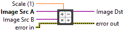 | Divides one image by another image or an image by a constant. |
| [LogDiff](../operators/logdiff/README.md) | 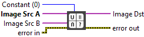 | Keeps bits found in Image Src A that are absent from Image Src B. |
| [Mask](../operators/mask/README.md) | 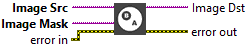 | Recopies the Image Src into the Image Dst. |
| [Multiply](../../../_resolved/multiply/README.md) |  | Multiplies two images or an image and a constant. |
| [Or](../../../_resolved/or/README.md) | [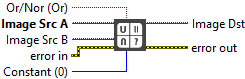](../operators/weighted-sum/README.md) | Performs an OR or NOR operation on two images or an image and a constant. |
| [Segmentation Mask](../operators/segmentation-mask/README.md) | 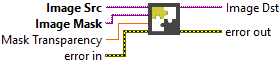 | The Segmentation Mask function merges a base image with a color mask using a given opacity factor, producing a partially masked image. |
| [Segmentation Masks](../operators/segmentation-masks/README.md) | 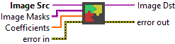 | The Segmentation Mask function merges a base image with multiple color masks using a given opacity factor for every mask, producing a partially masked image. |
| [Split](../../../_resolved/split/README.md) | 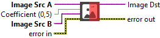 | The Split Image function merges two images by dividing horizontally according to a coefficient, creating a new image. |
| [Subtract](../operators/subtract/README.md) | 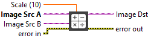 | Subtracts one image from another or a constant from an image. |
| [Weighted Sum](../operators/weighted-sum/README.md) | 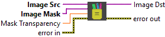 | The Weighted Sum function merges a base image with an other one (generally a mask) using a given coefficient. |
| [Match Template](../operators/weighted-sum/README.md) |  | Search Image Template in Image Src and add bounding box to Image Dst where it is located. |
| [Auto Adjust Contrast](../treatment/auto-adjust-contrast/README.md) | 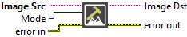 | Boosts contrast based on the image’s histogram to improve normalization and line detection in varying lighting conditions. |
| [BCG Lookup](../treatment/bcg-lookup/README.md) | 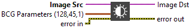 | Applies a brightness, contrast, and gamma correction to an image. |
| [Exposure](../treatment/exposure/README.md) |  | Converts Src pixel values to the Dst image according to this formula ((a(*Src)(x,y)+ß)).​ |
| [Hue](../treatment/hue/README.md) | 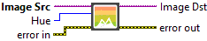 | Adjust the hue in the image. |
| [Inverse](../../../_resolved/inverse/README.md) | 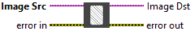 | Inverts the pixel intensities of an image to compute the negative of an image. |
| [Local Threshold](../treatment/local-threshold/README.md) | 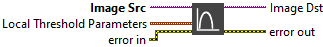 | Thresholds an image into a binary image based on the specified local adaptive thresholding method. |
| [Magic Wand](../treatment/magic-wand/README.md) |  | Creates an image mask by extracting a region surrounding a reference pixel, called the origin, and using a tolerance of intensity variations based on this reference pixel. |
| [Multi Threshold](../treatment/multi-threshold/README.md) | 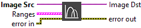 | Performs thresholds of multiple intensity ranges to an image. |
| [Noise](../treatment/noise/README.md) | 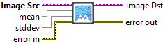 | Fills the matrix dst with normally distributed random numbers with the specified mean vector and the standard deviation matrix. The generated random numbers are clipped to fit the value range of the output array data type. |
| [Normalize](../treatment/normalize/README.md) | 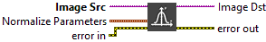 | Normalizes the norm or value range of an array. |
| [Perspective Transform](../treatment/perspective-transform/README.md) | 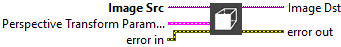 | Calculates a perspective transform from four pairs of the corresponding points. |
| [Saturation](../treatment/saturation/README.md) | 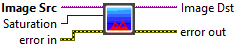 | Adjust the saturation in the image.​ |
| [Threshold](../treatment/threshold/README.md) | 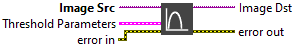 | Applies a threshold to an image. |
| [User Lookup](../treatment/user-lookup/README.md) | 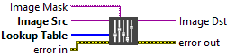 | Performs a user-specified lookup-table transformation by remapping the pixel values in an image. |
| [Value](../treatment/value/README.md) | 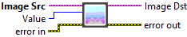 | Adjust the value in the image. |
