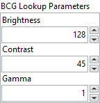

<h1>BCG Lookup</h1>

<h2>Description</h2>

Applies a brightness, contrast, and gamma correction to an image. The correction is performed by computing and applying a lookup table. Brightness, Contrast, and Gamma control the changes made to the transfer function represented by the lookup table. Type : <em><strong>polymorphic</strong><strong>.</strong></em>

<h3>Input parameters</h3>

<table>
  <tbody>
    <tr>
      <td width="64" valign="top"></td>
      <td valign="top"><strong>Image Src : <em>class,</em> </strong>type accepted <strong>U8</strong>, <strong>RGB</strong> and <strong>HSL</strong>.</td>
    </tr>
  </tbody>
</table>

<table>
  <tbody>
    <tr>
      <td valign="top" width="70%"><table>
  <tbody>
    <tr>
      <td width="64" valign="top"></td>
      <td valign="top"><strong>BCG Lookup Parameters :<em> cluster,</em></strong></td>
    </tr>
    <tr>
      <td></td>
      <td valign="top"><table>
  <tbody>
    <tr>
      <td width="64" valign="top"></td>
      <td valign="top"><strong>Brightness : <em>float, </em></strong>sets the brightness of the image. This value is used as the x intercept of the transfer function in the lookup table. The neutral value is 128 (no change in the image). A higher value returns a brighter image. A value less than 128 decreases the overall brightness of the image.</td>
    </tr>
    <tr>
      <td width="64" valign="top"></td>
      <td valign="top">Contrast :<em> float, </em>sets the contrast of the image. This control is used as the slope of the transfer function in the lookup table and is expressed in degrees. A slope of 45 degrees is neutral. A higher value returns a more contrasted image. A value smaller than 45 decreases the contrast of the image.</td>
    </tr>
    <tr>
      <td width="64" valign="top"></td>
      <td valign="top">Gamma :<em> float, </em>sets the gamma correction applied to the image. The neutral value is 1. A value greater than 1 gives extended contrast for small pixel values and less contrast for large pixel values. A value smaller than 1 returns an image with less contrast for small pixel values and extended contrast for large pixel values.</td>
    </tr>
  </tbody>
</table></td>
    </tr>
  </tbody>
</table></td>
      <td valign="top" width="30%">

</td>
    </tr>
  </tbody>
</table>

<h3>Output parameters</h3>

<table>
  <tbody>
    <tr>
      <td width="64" valign="top"></td>
      <td valign="top"><strong>Image Dst :<em> class</em></strong></td>
    </tr>
  </tbody>
</table>

<h2>Examples</h2>

All these examples are snippets PNG, you can drop these Snippet onto the block diagram and get the depicted code added to your VI (Do not forget to install Computer Vision ​library to run it).

