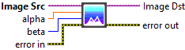

<h1>Exposure</h1>

<h2>Description</h2>

Converts Src pixel values to the Dst image according to this formula ((a(*Src)(x,y)+ß)).​ Type : <em><strong>polymorphic</strong><strong>.</strong></em>

<h3>Input parameters</h3>

<table>
  <tbody>
    <tr>
      <td width="64" valign="top"></td>
      <td valign="top"><strong>Image Src : <em>class, </em></strong>type accepted <strong>U8</strong>, <strong>I16</strong>, <strong>RGB</strong> and <strong>HSL.</strong></td>
    </tr>
    <tr>
      <td width="64" valign="top"></td>
      <td valign="top">alpha : <em>float</em>, optional scale factor.</td>
    </tr>
    <tr>
      <td width="64" valign="top"></td>
      <td valign="top"><strong>beta : <em>integer</em>, </strong>optional delta added to the scaled values.</td>
    </tr>
  </tbody>
</table>

<h3>Output parameters</h3>

<table>
  <tbody>
    <tr>
      <td width="64" valign="top"></td>
      <td valign="top"><strong>Image Dst : <em>class</em></strong></td>
    </tr>
  </tbody>
</table>

<h2>Examples</h2>

All these examples are snippets PNG, you can drop these Snippet onto the block diagram and get the depicted code added to your VI (Do not forget to install Computer Vision ​library to run it).

