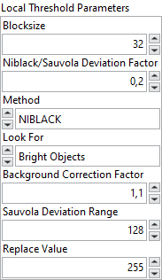

<h1>Local Threshold</h1>

<h2>Description</h2>

Thresholds an image into a binary image based on the specified local adaptive thresholding method. Type : <em><strong>polymorphic</strong><strong>.</strong></em>

<h3>Input parameters</h3>

<table>
  <tbody>
    <tr>
      <td width="64" valign="top"></td>
      <td valign="top"><strong>Image Src : <em>class, </em></strong>type accepted<strong> U8 </strong>and <strong>I16.</strong></td>
    </tr>
  </tbody>
</table>

<table>
  <tbody>
    <tr>
      <td valign="top" width="70%"><table>
  <tbody>
    <tr>
      <td width="64" valign="top"></td>
      <td valign="top"><strong>Local Threshold Parameters :<em> cluster,</em></strong></td>
    </tr>
    <tr>
      <td></td>
      <td valign="top"><table>
  <tbody>
    <tr>
      <td width="64" valign="top"></td>
      <td valign="top"><strong>Blocksize : <em>integer, </em></strong>size of the window the VI uses when calculating a local threshold.</td>
    </tr>
    <tr>
      <td width="64" valign="top"></td>
      <td valign="top">Niblack/Sauvola Deviation Factor :<em> float, </em>specifies the <em>k</em> constant used in the Niblack and Sauvola local thresholding algorithms, which determines the weight applied to the variance calculation. The lower the Deviation Factor, the closer the pixel value must be to the mean value to be selected as part of a particle. Setting the <strong>Niblack/Sauvola Deviation Factor</strong> to 0 will increase the performance of the VI because will not calculate the variance for any of the pixels. The function ignores this value if <strong>Method</strong> is not set to Niblack or Sauvola.</td>
    </tr>
    <tr>
      <td width="64" valign="top"></td>
      <td valign="top">Method :<em> enum, </em>specifies the local thresholding algorithm the function uses.
<ul>
<li>
<ul>
<li>
<ul>
<li>NIBLACK : computes thresholds for each pixel based on its local statistics using the Niblack local thresholding algorithm</li>
<li>BACKGROUND_CORRECTION : performs background correction to eliminate non-uniform lighting effects and then performs thresholding using the interclass variance thresholding algorithm</li>
<li>SAUVOLA : computes thresholds for each pixel based on its local statistics and also uses the global standard deviation, using the Sauvola local thresholding algorithm</li>
<li>MODIFIED SAUVOLA : computes thresholds for each pixel based on its local statistics and the mean deviation, using the Modified Sauvola local thresholding algorithm</li>
</ul>
</li>
</ul>
</li>
</ul></td>
    </tr>
    <tr>
      <td width="64" valign="top"></td>
      <td valign="top"><strong>Look For :<em> enum, i</em></strong>ndicates the type of objects for which you want to look.
<ul>
<li>
<ul>
<li>
<ul>
<li>Bright Objects : looks for objects in the image represented by pixels with values greater than the value computed by the threshold method</li>
<li>Dark Objects : looks for objects in the image represented by pixels with values less than the value computed by the threshold method</li>
</ul>
</li>
</ul>
</li>
</ul></td>
    </tr>
    <tr>
      <td width="64" valign="top"></td>
      <td valign="top"><strong>Background Correction Factor :<em> float, </em></strong>is a correction factor used only in the background correction method.</td>
    </tr>
    <tr>
      <td width="64" valign="top"></td>
      <td valign="top">Sauvola Deviation Range :<em> float, </em>specifies the <em>R</em> constant used in the Sauvola local thresholding algorithm. The Sauvola Deviation Range and the <strong>Niblack/Sauvola Deviation Factor</strong> both determine the threshold calculation. The <strong>Sauvola Deviation Range</strong> is used to obtain better noise control in the thresholded image. The deviation range is equivalent to the dynamic range of the standard deviation of the image. Valid R constants depend on the bit depth of the image. For 8-bit images, the range is 1 to 255. For 16-bit images, the range is 1 to 65535. The function ignores this value if <strong>Method</strong> is not set to Sauvola.</td>
    </tr>
    <tr>
      <td width="64" valign="top"></td>
      <td valign="top">Replace Value :<em> integer, </em>specifies the replacement value the VI uses for the pixels of the kept objects in the destination image.</td>
    </tr>
  </tbody>
</table></td>
    </tr>
  </tbody>
</table></td>
      <td valign="top" width="30%">

</td>
    </tr>
  </tbody>
</table>

<h3>Output parameters</h3>

<table>
  <tbody>
    <tr>
      <td width="64" valign="top"></td>
      <td valign="top"><strong>Image Dst :<em> class</em></strong></td>
    </tr>
  </tbody>
</table>

<h2>Examples</h2>

All these examples are snippets PNG, you can drop these Snippet onto the block diagram and get the depicted code added to your VI (Do not forget to install Computer Vision ​library to run it).

