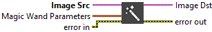
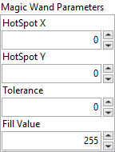

<h1>Magic Wand</h1>

<h2>Description</h2>

Creates an image mask by extracting a region surrounding a reference pixel, called the origin, and using a tolerance of intensity variations based on this reference pixel. Type : <em><strong>polymorphic</strong><strong>.</strong></em>

<h3>Input parameters</h3>

<table>
  <tbody>
    <tr>
      <td width="64" valign="top"></td>
      <td valign="top"><strong>Image Src : <em>class, </em></strong>type accepted<strong> U8 </strong>and <strong>I16.</strong></td>
    </tr>
  </tbody>
</table>

<table>
  <tbody>
    <tr>
      <td valign="top" width="70%"><table>
  <tbody>
    <tr>
      <td width="64" valign="top"></td>
      <td valign="top"><strong>Magic Wand Parameters :<em> cluster,</em></strong></td>
    </tr>
    <tr>
      <td></td>
      <td valign="top"><table>
  <tbody>
    <tr>
      <td width="64" valign="top"></td>
      <td valign="top"><strong>HotSpot X : <em>integer, </em></strong>coordinates X of the origin pixel chosen from the image source.</td>
    </tr>
    <tr>
      <td width="64" valign="top"></td>
      <td valign="top">HotSpot Y :<em> integer, </em>coordinates Y of the origin pixel chosen from the image source.</td>
    </tr>
    <tr>
      <td width="64" valign="top"></td>
      <td valign="top">Tolerance :<em> float, </em>is the maximum allowed deviation from the origin.</td>
    </tr>
    <tr>
      <td width="64" valign="top"></td>
      <td valign="top">Fill Value :<em> integer, </em>is the value used for the highlighted pixels in the destination image.</td>
    </tr>
  </tbody>
</table></td>
    </tr>
  </tbody>
</table></td>
      <td valign="top" width="30%">

</td>
    </tr>
  </tbody>
</table>

<h3>Output parameters</h3>

<table>
  <tbody>
    <tr>
      <td width="64" valign="top"></td>
      <td valign="top"><strong>Image Dst :<em> class</em></strong></td>
    </tr>
  </tbody>
</table>

<h2>Examples</h2>

All these examples are snippets PNG, you can drop these Snippet onto the block diagram and get the depicted code added to your VI (Do not forget to install Computer Vision ​library to run it).

