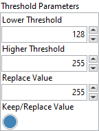

<h1>Threshold</h1>

<h2>Description</h2>

Applies a threshold to an image. Type : <em><strong>polymorphic</strong><strong>.</strong></em>

<h3>Input parameters</h3>

<table>
  <tbody>
    <tr>
      <td width="64" valign="top"></td>
      <td valign="top"><strong>Image Src : <em>class, </em></strong>type accepted <strong>U8</strong> and <strong>I16</strong>.</td>
    </tr>
  </tbody>
</table>

<table>
  <tbody>
    <tr>
      <td valign="top" width="70%"><table>
  <tbody>
    <tr>
      <td width="64" valign="top"></td>
      <td valign="top"><strong>Threshold Parameters :<em> cluster,</em></strong></td>
    </tr>
    <tr>
      <td></td>
      <td valign="top"><table>
  <tbody>
    <tr>
      <td width="64" valign="top"></td>
      <td valign="top"><strong>Lower Threshold : <em>integer, </em></strong>is the lowest pixel value used during a threshold.</td>
    </tr>
    <tr>
      <td width="64" valign="top"></td>
      <td valign="top">Higher Threshold :<em> integer, </em>is the highest pixel value used during a threshold.</td>
    </tr>
    <tr>
      <td width="64" valign="top"></td>
      <td valign="top">Replace Value :<em> integer, </em>is the value used to replace pixels between the <strong>Lower value</strong> and <strong>Higher value</strong>. This operation requires that <strong>Keep/Replace Value</strong> is TRUE.</td>
    </tr>
    <tr>
      <td width="64" valign="top"></td>
      <td valign="top">Keep/Replace Value :<em> boolean, </em>determines whether to replace the value of the pixels existing in the range between <strong>Lower value</strong> and <strong>Higher value</strong>. The default status, TRUE, replaces these pixel values, and the status FALSE keeps the original values.</td>
    </tr>
  </tbody>
</table></td>
    </tr>
  </tbody>
</table></td>
      <td valign="top" width="30%">

</td>
    </tr>
  </tbody>
</table>

<h3>Output parameters</h3>

<table>
  <tbody>
    <tr>
      <td width="64" valign="top"></td>
      <td valign="top"><strong>Image Dst :<em> class</em></strong></td>
    </tr>
  </tbody>
</table>

<h2>Examples</h2>

All these examples are snippets PNG, you can drop these Snippet onto the block diagram and get the depicted code added to your VI (Do not forget to install Computer Vision ​library to run it).

