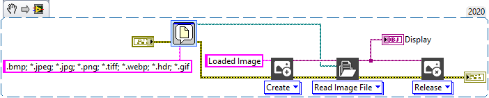
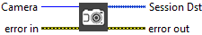
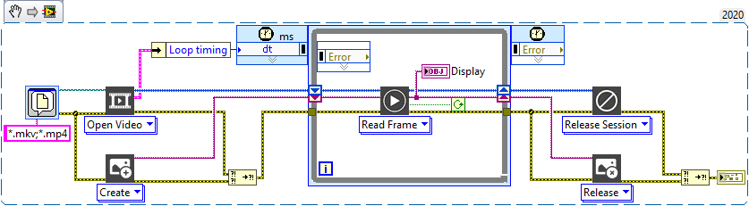

<h1>Beginner’s Guide</h1>

In this <strong>quick tutorial section</strong>, we will show how to open an image, grab a camera, play video and use computer vision functionalities.

<h2>How to open an image ?</h2>

This section will quick guide you to show the open image system of the TIGR, image and vision toolkit for LabVIEW.

<table>
  <tbody>
    <tr>
      <td valign="top" width="50%">
<a href="https://www.youtube.com/embed/2tLTSuQBt3c?feature=oembed">Get started - Read Image File with TIGR vision toolkit for LabVIEW</a>
</td>
      <td valign="top" width="50%">
<strong>Code used for this video</strong>

You can drop this snippet onto the block diagram and get the depicted code added to your VI (do not forget to install TIGR library before).

</td>
    </tr>
  </tbody>
</table>

<h2>How to open a camera ?</h2>

This section will quick guide you to show how to open a camera with the TIGR, image abnd vision toolkit for LabVIEW.

<table>
  <tbody>
    <tr>
      <td valign="top" width="50%">
<a href="https://www.youtube.com/embed/dLkRw9v3Z6Y?feature=oembed">Get started - Open a camera with TIGR vision toolkit for LabVIEW</a>
</td>
      <td valign="top" width="50%">
<strong>Code used for this video</strong>

You can drop this snippet onto the block diagram and get the depicted code added to your VI (do not forget to install TIGR library before).

</td>
    </tr>
  </tbody>
</table>

<h2>How to open a video ?</h2>

This section will quick guide you to show how to play a video with the TIGR, image abnd vision toolkit for LabVIEW.

<table>
  <tbody>
    <tr>
      <td valign="top" width="50%">
<a href="https://www.youtube.com/embed/P9mON_WxFQg?feature=oembed">Get started - Play a Video File with TIGR vision toolkit for LabVIEW</a>
</td>
      <td valign="top" width="50%">
<strong>Code used for this video</strong>

You can drop this snippet onto the block diagram and get the depicted code added to your VI (do not forget to install TIGR library before).

</td>
    </tr>
  </tbody>
</table>

<h2>Quickly open examples from the palette</h2>

This section will quick guide you to show how to quickly open examples from the palette with the TIGR, image and vision toolkit for LabVIEW.

<table>
  <tbody>
    <tr>
      <td valign="top" width="50%">
<a href="https://www.youtube.com/embed/ZK8rxpYI3ek?feature=oembed">Get started - quick launch of examples from the palette with TIGR vision toolkit for LabVIEW</a>
</td>
      <td valign="top" width="50%">
<strong>Code used for this video</strong>

You can drop this snippet onto the block diagram and get the depicted code added to your VI (do not forget to install TIGR library before).

</td>
    </tr>
  </tbody>
</table>
