<h1>CV Display</h1>

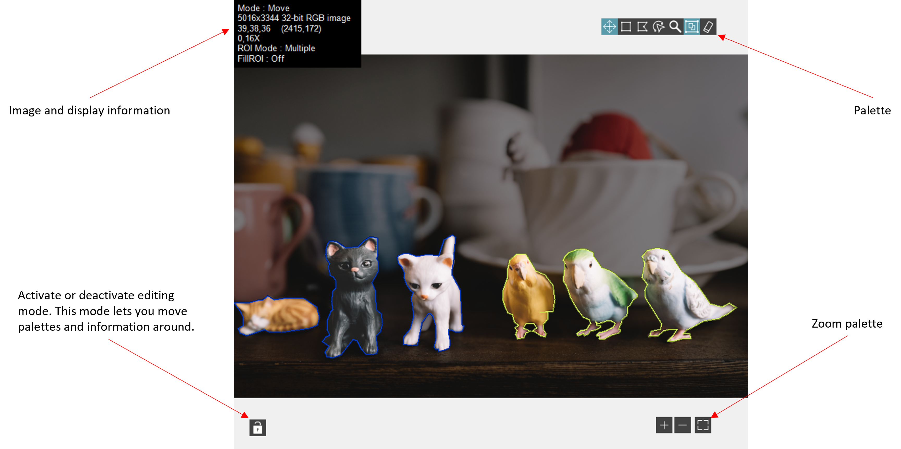

<h2>Shortcut Menu</h2>

<table>
  <tbody>
    <tr>
      <td valign="top" width="62%">
<strong>Lock :</strong> mode for modifying the CV display interface.

<ul>
<li>
<ul>
<li>On/Off : locks or unlocks pallets (grayed out if no pallet visible).</li>
<li>Reset : reset the CV display interface.</li>
</ul>
</li>
</ul>

<strong>Display : </strong>toggle the visibility of buttons and widgets within the CV display interface.

<ul>
<li>
<ul>
<li>Lock : toggle the visibility of buttons lock.</li>
<li>Info Box : toggle the visibility of box information.</li>
<li>Palette : toggle the visibility of palette.</li>
<li>Zoom : toggle the visibility of zoom palette.</li>
<li>ROI color : toggle the visibility of ROI color boxes.</li>
<li>Palette Buttons : toggle the visibility of palette buttons.
<ul>
<li>
<ul>
<li>Move : move ROIs</li>
<li>Rectangle : draw rectangle</li>
<li>Polygon : draw polygon</li>
<li>Freehand : draw freehand region</li>
<li>Zoom : zoom in and out</li>
<li>Multiple ROI : allows you to draw multiple ROI</li>
<li>Erase : deletes all ROIs</li>
<li>Default : makes all pallet buttons visible</li>
</ul>
</li>
</ul>
</li>
<li>Info Box Lines : toggle the visibility of info box lines.
<ul>
<li>
<ul>
<li>Palette Mode : indicates the mode selected on the palette</li>
<li>Image Info : indicates some information about the image, such as its size, depth and the model used</li>
<li>Mouse Info : RGB value of the pixel where the mouse is positioned and its position</li>
<li>Zoom : zoom factor</li>
<li>ROI Mode : display mode</li>
<li>FilI ROI : display fill mode</li>
<li>Default : makes all info line visible</li>
</ul>
</li>
</ul>
</li>
</ul>
</li>
</ul>

<strong>Color Palette : </strong>changes color palette for grayscale image.

<ul>
<li>
<ul>
<li>Grayscale : Gradual grayscale variation from black to white.</li>
<li>Binary : 16 cycles of 16 different colors, where g is the grayscale value and g = 0 corresponds to R = 0, G = 0, B = 0 (black); g = 1 corresponds to R = 255, G = 0, B = 0 (red); g = 2 corresponds to R = 0, G = 255, B = 0 (green); and so on.</li>
<li>Gradient : Gradation from red to white with a prominent range of light blue in the upper range. 0 is black and 255 is white.</li>
<li>Rainbow : Gradation from blue to red with a prominent range of greens in the middle value range. 0 is black and 255 is white.</li>
<li>Temperature : Gradation from light brown to dark brown. 0 is black and 255 is white.</li>
<li>User Defined : User Palette defined with Display Property Node.</li>
</ul>
</li>
</ul>

<strong>Mode : </strong>changes display mode.

<ul>
<li>
<ul>
<li>Move : move ROIs</li>
<li>Rectangle : draw rectangle</li>
<li>Polygon : draw polygon</li>
<li>Freehand : draw freehand region</li>
<li>Zoom : zoom in and out</li>
</ul>
</li>
</ul>

<strong>ROI : </strong>toggle the visibility of buttons and widgets within the CV display interface.

<ul>
<li>
<ul>
<li>Mode :
<ul>
<li>Multiple : selects whether you want to display one or mode ROIs.</li>
<li>Fill ROI : define whether the CV diplay should fill the ROI.</li>
<li>Annotation : define whether the CV diplay should display the Annotation Editor Windows</li>
</ul>
</li>
</ul>
<ul>
<li>Border Size : ROI border size.
<ul>
<li>Thin</li>
<li>Medium</li>
<li>Thick</li>
</ul>
</li>
</ul>
<ul>
<li>Color : defines the current color of the ROI drawing.</li>
<li>Clear ROI : deletes all ROIs.</li>
</ul>
</li>
</ul>

<strong>Background Color : </strong>changes the background color of the CV display.
</td>
      <td valign="top" width="38%">
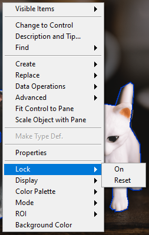

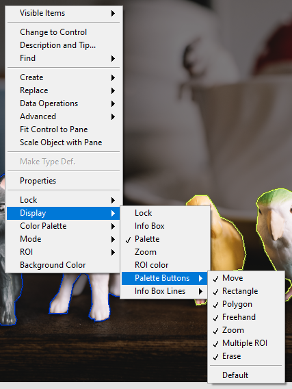

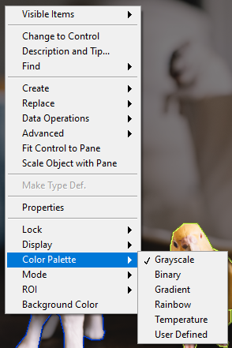

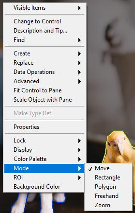

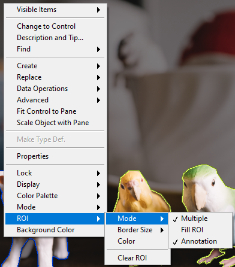
</td>
    </tr>
  </tbody>
</table>

<h2>Methods</h2>

<table>
  <tbody>
    <tr>
      <td valign="top" width="70%">
<strong>Add Or Update Class : </strong>removes all ROIs from the image.

<table>
  <tbody>
    <tr>
      <td width="64" valign="top"></td>
      <td valign="top"><strong>Class : <em>cluster,</em></strong></td>
    </tr>
    <tr>
      <td></td>
      <td valign="top"><table>
  <tbody>
    <tr>
      <td width="64" valign="top"></td>
      <td valign="top"><strong>ClassName : <em>string,</em></strong> class name.</td>
    </tr>
    <tr>
      <td width="64" valign="top"></td>
      <td valign="top"><strong>Color : <em>integer,</em></strong> color value.</td>
    </tr>
  </tbody>
</table></td>
    </tr>
  </tbody>
</table></td>
      <td valign="top" width="30%">
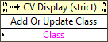
</td>
    </tr>
  </tbody>
</table>

<table>
  <tbody>
    <tr>
      <td valign="top" width="75%">
<strong>Clear ROI : </strong>removes all ROIs from the image.
</td>
      <td valign="top" width="25%">
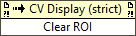
</td>
    </tr>
  </tbody>
</table>

<table>
  <tbody>
    <tr>
      <td valign="top" width="70%">
<strong>Display All Class Name :</strong> displays a class assigned to ROIs on the CV display.

<table>
  <tbody>
    <tr>
      <td width="64" valign="top"></td>
      <td valign="top"><strong>Display ? : <em>boolean,</em></strong> if true, the class defined by “Class Name” is displayed on the CV display.</td>
    </tr>
    <tr>
      <td width="64" valign="top"></td>
      <td valign="top"><strong>Class Name : <em>string,</em></strong> class name.
<ul>
<li>
<ul>
<li>
<ul>
<li>If Class Name == “” ⇒ displays all classes assigned to ROIs.</li>
<li>If Class Name == “my_class_name” ⇒ displays only the class whose name is “my_class_name”.</li>
</ul>
</li>
</ul>
</li>
</ul></td>
    </tr>
  </tbody>
</table></td>
      <td valign="top" width="30%">
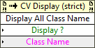
</td>
    </tr>
  </tbody>
</table>

<table>
  <tbody>
    <tr>
      <td valign="top" width="70%">
<strong>Display One Index :</strong> displays one ROI on the CV display.

<table>
  <tbody>
    <tr>
      <td width="64" valign="top"></td>
      <td valign="top"><strong>Display ? : <em>boolean,</em></strong> if true, the ROI defined by “Index” is displayed on the CV display.</td>
    </tr>
    <tr>
      <td width="64" valign="top"></td>
      <td valign="top"><strong>Index : <em>integer,</em></strong> index of ROI.
<ul>
<li>
<ul>
<li>
<ul>
<li>If Index == -1 ⇒ displays nothing.</li>
<li>If Index == [0-n] ⇒ displays ROI.</li>
</ul>
</li>
</ul>
</li>
</ul></td>
    </tr>
  </tbody>
</table></td>
      <td valign="top" width="30%">
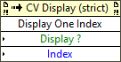
</td>
    </tr>
  </tbody>
</table>

<table>
  <tbody>
    <tr>
      <td valign="top" width="70%">
<strong>Remove Class :</strong> remove a class from the list of classes and delete all ROIs of this class.

<table>
  <tbody>
    <tr>
      <td width="64" valign="top"></td>
      <td valign="top"><strong>ClassName : <em>string,</em></strong> class name.</td>
    </tr>
  </tbody>
</table></td>
      <td valign="top" width="30%">
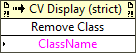
</td>
    </tr>
  </tbody>
</table>

<table>
  <tbody>
    <tr>
      <td valign="top" width="75%">
<strong>Reset : </strong>reset the CV display interface.

<ul>
<li>
<ul>
<li>Display only palette (with full buttons)</li>
<li>Move the palette to the middle left (Vertical)</li>
<li>Move the zoom palette to the middle right (Vertical)</li>
<li>Move the label to the upper middle</li>
</ul>
</li>
</ul></td>
      <td valign="top" width="25%">
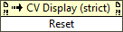
</td>
    </tr>
  </tbody>
</table>

<table>
  <tbody>
    <tr>
      <td valign="top" width="75%">
<strong>Set Auto Zoom : </strong>sets the display auto zoom mode, every time an image is displayed the zoom adapt to the size of the image.
</td>
      <td valign="top" width="25%">
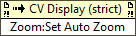
</td>
    </tr>
  </tbody>
</table>

<table>
  <tbody>
    <tr>
      <td valign="top" width="70%">
<strong>Zoom:Zoom in :</strong> zooms in by centering the image on the coordinates defined by Zoom Center.

<table>
  <tbody>
    <tr>
      <td width="64" valign="top"></td>
      <td valign="top"><strong>Zoom Center : <em>cluster,</em></strong> zoom-in position.</td>
    </tr>
    <tr>
      <td></td>
      <td valign="top"><table>
  <tbody>
    <tr>
      <td width="64" valign="top"></td>
      <td valign="top"><strong>X : <em>integer,</em></strong> X coordinate.</td>
    </tr>
    <tr>
      <td width="64" valign="top"></td>
      <td valign="top"><strong>Y : <em>integer,</em></strong> Y coordinate.</td>
    </tr>
  </tbody>
</table></td>
    </tr>
  </tbody>
</table>

Note : if Zoom Center.X &lt; 0 or Zoom Center.Y &lt;0, zooming will be to the center.
</td>
      <td valign="top" width="30%">
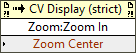
</td>
    </tr>
  </tbody>
</table>

<table>
  <tbody>
    <tr>
      <td valign="top" width="70%">
<strong>Zoom:Zoom out :</strong> zooms out by centering the image on the coordinates defined by Zoom Center.

<table>
  <tbody>
    <tr>
      <td width="64" valign="top"></td>
      <td valign="top"><strong>Zoom Center : <em>cluster,</em></strong> zoom-out position.</td>
    </tr>
    <tr>
      <td></td>
      <td valign="top"><table>
  <tbody>
    <tr>
      <td width="64" valign="top"></td>
      <td valign="top"><strong>X : <em>integer,</em></strong> X coordinate.</td>
    </tr>
    <tr>
      <td width="64" valign="top"></td>
      <td valign="top"><strong>Y : <em>integer,</em></strong> Y coordinate.</td>
    </tr>
  </tbody>
</table></td>
    </tr>
  </tbody>
</table>

Note : if Zoom Center.X &lt; 0 or Zoom Center.Y &lt;0, zooming will be to the center.
</td>
      <td valign="top" width="30%">
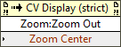
</td>
    </tr>
  </tbody>
</table>

<h2>Properties</h2>

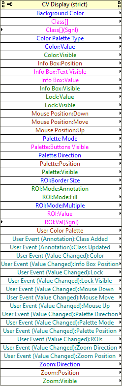

<strong>Backgroung Color : <em>cluster,</em></strong> changes the background color of the CV display (permissions : read/write).

<table>
  <tbody>
    <tr>
      <td valign="top" width="70%">
<strong>Class[] : <em>array,</em></strong> get or set classes. (permissions : read/write).

<table>
  <tbody>
    <tr>
      <td width="64" valign="top"></td>
      <td valign="top"><strong>ClassName : <em>string,</em></strong> class name.</td>
    </tr>
    <tr>
      <td width="64" valign="top"></td>
      <td valign="top"><strong>Color : <em>integer,</em></strong> color value.</td>
    </tr>
  </tbody>
</table></td>
      <td valign="top" width="30%">
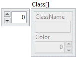
</td>
    </tr>
  </tbody>
</table>

<table>
  <tbody>
    <tr>
      <td valign="top" width="70%">
<strong>Class[] (Sgnl) : <em>array,</em></strong> set classes and generate “Class Added” event. (permissions : write only).

<table>
  <tbody>
    <tr>
      <td width="64" valign="top"></td>
      <td valign="top"><strong>ClassName : <em>string,</em></strong> class name.</td>
    </tr>
    <tr>
      <td width="64" valign="top"></td>
      <td valign="top"><strong>Color : <em>integer,</em></strong> color value.</td>
    </tr>
  </tbody>
</table></td>
      <td valign="top" width="30%">

</td>
    </tr>
  </tbody>
</table>

<strong>Color Palette Type : <em>enum,</em></strong> color palette selection (permissions : read/write).

<ul>
<li>
<ul>
<li>Grayscale : Gradual grayscale variation from black to white.</li>
<li>Binary : 16 cycles of 16 different colors, where g is the grayscale value and g = 0 corresponds to R = 0, G = 0, B = 0 (black); g = 1 corresponds to R = 255, G = 0, B = 0 (red); g = 2 corresponds to R = 0, G = 255, B = 0 (green); and so on.</li>
<li>Gradient : Gradation from red to white with a prominent range of light blue in the upper range. 0 is black and 255 is white.</li>
<li>Rainbow : Gradation from blue to red with a prominent range of greens in the middle value range. 0 is black and 255 is white.</li>
<li>Temperature : Gradation from light brown to dark brown. 0 is black and 255 is white.</li>
<li>User Defined : User Palette defined with User Color Palette Property.</li>
</ul>
</li>
</ul>

<strong>Color:Value : <em>integer,</em></strong> color used to draw news ROIs (permissions : read/write). <strong>Color:Visible : <em>boolean,</em></strong> indicates whether the color box is visible (permissions : read/write).

<table>
  <tbody>
    <tr>
      <td valign="top" width="70%">
<strong>Info Box:Position : <em>cluster,</em></strong> position of the top left corner of the label (permissions : read/write).

<table>
  <tbody>
    <tr>
      <td width="64" valign="top"></td>
      <td valign="top"><strong>X : <em>integer,</em></strong> X coordinate.</td>
    </tr>
    <tr>
      <td width="64" valign="top"></td>
      <td valign="top"><strong>Y : <em>integer,</em></strong> Y coordinate.</td>
    </tr>
  </tbody>
</table></td>
      <td valign="top" width="30%">
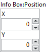
</td>
    </tr>
  </tbody>
</table>

<table>
  <tbody>
    <tr>
      <td valign="top" width="70%">
<strong>Info Box:Text Visible : <em>cluster,</em></strong> text written in the label (permissions : read/write).

<table>
  <tbody>
    <tr>
      <td width="64" valign="top"></td>
      <td valign="top"><strong>Palette Mode : <em>boolean, </em></strong>indicates the mode selected on the palette.</td>
    </tr>
    <tr>
      <td width="64" valign="top"></td>
      <td valign="top"><strong>Image Info : <em>boolean</em><em>,</em></strong> indicates some information about the image, such as its size, depth and the model used.</td>
    </tr>
    <tr>
      <td width="64" valign="top"></td>
      <td valign="top"><strong>Mouse Info : <em>boolean</em><em>, </em></strong>RGB value of the pixel where the mouse is positioned and its position.</td>
    </tr>
    <tr>
      <td width="64" valign="top"></td>
      <td valign="top"><strong>Zoom : <em>boolean</em><em>, </em></strong>zoom factor.</td>
    </tr>
    <tr>
      <td width="64" valign="top"></td>
      <td valign="top"><strong>Roi Mode : <em>boolean</em><em>, </em></strong>display mode.</td>
    </tr>
    <tr>
      <td width="64" valign="top"></td>
      <td valign="top"><strong>Fill Roi : <em>boolean</em><em>, </em></strong>display fill mode.</td>
    </tr>
  </tbody>
</table></td>
      <td valign="top" width="30%">
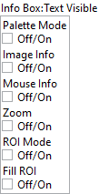
</td>
    </tr>
  </tbody>
</table>

<table>
  <tbody>
    <tr>
      <td valign="top" width="70%">
<strong>Info Box:Value : <em>cluster,</em></strong> text written in the label (permissions : read only).

<table>
  <tbody>
    <tr>
      <td width="64" valign="top"></td>
      <td valign="top"><strong>Mode : <em>string, </em></strong>indicates the mode selected on the palette.</td>
    </tr>
    <tr>
      <td width="64" valign="top"></td>
      <td valign="top"><strong>Image Info : <em>string,</em></strong> indicates some information about the image, such as its size, depth and the model used.</td>
    </tr>
    <tr>
      <td width="64" valign="top"></td>
      <td valign="top"><strong>Mouse : <em>string, </em></strong>RGB value of the pixel where the mouse is positioned and its position.</td>
    </tr>
    <tr>
      <td width="64" valign="top"></td>
      <td valign="top"><strong>Zoom : <em>string, </em></strong>zoom factor.</td>
    </tr>
    <tr>
      <td width="64" valign="top"></td>
      <td valign="top"><strong>Roi Mode : <em>string, </em></strong>display mode.</td>
    </tr>
    <tr>
      <td width="64" valign="top"></td>
      <td valign="top"><strong>Fill Roi : <em>string, </em></strong>display fill mode.</td>
    </tr>
  </tbody>
</table></td>
      <td valign="top" width="30%">
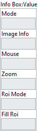
</td>
    </tr>
  </tbody>
</table>

<strong>Lock:Value : <em>boolean,</em></strong> if true, you can modify the CV interface (permissions : read/write). <strong>Lock:Visible : <em>boolean,</em></strong> indicates whether the lock button is visible (permissions : read/write).

<table>
  <tbody>
    <tr>
      <td valign="top" width="70%">
<strong>Mouse Position:Down : <em>cluster,</em></strong> last mouse down position (in pixels in the image coordinate system)  (permissions : read only).

<table>
  <tbody>
    <tr>
      <td width="64" valign="top"></td>
      <td valign="top"><strong>X : <em>integer,</em></strong> X coordinate.</td>
    </tr>
    <tr>
      <td width="64" valign="top"></td>
      <td valign="top"><strong>Y : <em>integer,</em></strong> Y coordinate.</td>
    </tr>
  </tbody>
</table>

<strong>Mouse Position:Move : <em>cluster,</em></strong> last mouse move position (in pixels in the image coordinate system)  (permissions : read only).

<table>
  <tbody>
    <tr>
      <td width="64" valign="top"></td>
      <td valign="top"><strong>X : <em>integer,</em></strong> X coordinate.</td>
    </tr>
    <tr>
      <td width="64" valign="top"></td>
      <td valign="top"><strong>Y : <em>integer,</em></strong> Y coordinate.</td>
    </tr>
  </tbody>
</table>

<strong>Mouse Position:Up : <em>cluster,</em></strong> last mouse up position (in pixels in the image coordinate system)  (permissions : read only).

<table>
  <tbody>
    <tr>
      <td width="64" valign="top"></td>
      <td valign="top"><strong>X : <em>integer,</em></strong> X coordinate.</td>
    </tr>
    <tr>
      <td width="64" valign="top"></td>
      <td valign="top"><strong>Y : <em>integer,</em></strong> Y coordinate.</td>
    </tr>
  </tbody>
</table></td>
      <td valign="top" width="30%">
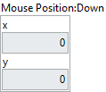

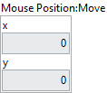

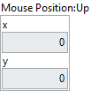
</td>
    </tr>
  </tbody>
</table>

<strong>Palette Mode : <em>enum,</em></strong> mode selection (permissions : read/write).

<ul>
<li>
<ul>
<li>Move : move ROIs</li>
<li>Rectangle : draw rectangle</li>
<li>Polygon : draw polygon</li>
<li>Freehand Region : draw freehand region</li>
<li>Zoom : zoom in and out</li>
</ul>
</li>
</ul>

<table>
  <tbody>
    <tr>
      <td valign="top" width="70%">
<strong>Palette:ButtonsVisible : <em>cluster,</em></strong> indicates whether the palette buttons are visible (permissions : read/write).

<table>
  <tbody>
    <tr>
      <td width="64" valign="top"></td>
      <td valign="top"><strong>Erase : <em>boolean</em><em>, </em></strong>indicates whether the button is visible.</td>
    </tr>
    <tr>
      <td width="64" valign="top"></td>
      <td valign="top"><strong>MultiROI : <em>boolean</em><em>,</em></strong> indicates whether the button is visible.</td>
    </tr>
    <tr>
      <td width="64" valign="top"></td>
      <td valign="top"><strong>Zoom : <em>boolean</em><em>, </em></strong>indicates whether the button is visible.</td>
    </tr>
    <tr>
      <td width="64" valign="top"></td>
      <td valign="top"><strong>Freehand : <em>boolean</em><em>, </em></strong>indicates whether the button is visible.</td>
    </tr>
    <tr>
      <td width="64" valign="top"></td>
      <td valign="top"><strong>Polygone : <em>boolean</em><em>, </em></strong>indicates whether the button is visible.</td>
    </tr>
    <tr>
      <td width="64" valign="top"></td>
      <td valign="top"><strong>Rectangle : <em>boolean</em><em>, </em></strong>indicates whether the button is visible.</td>
    </tr>
    <tr>
      <td width="64" valign="top"></td>
      <td valign="top"><strong>Move : <em>boolean</em><em>, </em></strong>indicates whether the button is visible.</td>
    </tr>
  </tbody>
</table></td>
      <td valign="top" width="30%">
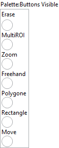
</td>
    </tr>
  </tbody>
</table>

<strong>Palette:Direction : <em>enum,</em></strong> decides whether the palette is in vertical or horizontal direction (permissions : read/write).

<table>
  <tbody>
    <tr>
      <td valign="top" width="70%">
<strong>Palette:Position : <em>cluster,</em></strong> position of the top left corner of the palette (permissions : read/write).

<table>
  <tbody>
    <tr>
      <td width="64" valign="top"></td>
      <td valign="top"><strong>X : <em>integer,</em></strong> X coordinate.</td>
    </tr>
    <tr>
      <td width="64" valign="top"></td>
      <td valign="top"><strong>Y : <em>integer,</em></strong> Y coordinate.</td>
    </tr>
  </tbody>
</table></td>
      <td valign="top" width="30%">
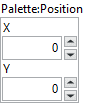
</td>
    </tr>
  </tbody>
</table>

<strong>Palette:Visible : <em>boolean,</em></strong> indicates whether the palette is visible (permissions : read/write). <strong>ROI:Border Size : <em>enum,</em></strong> ROI border size selection (permissions : read/write). <strong>ROI:Mode:Annotation : <em>boolean,</em></strong> define whether the CV diplay should display the Annotation Editor Windows (permissions : read/write). <strong>ROI:Mode:Fill : <em>boolean,</em></strong> define whether the CV diplay should fill the ROI (permissions : read/write). <strong>ROI:Mode:Multiple : <em>enum,</em></strong> selects whether you want to display one or more ROIs (permissions : read/write).

<table>
  <tbody>
    <tr>
      <td valign="top" width="70%">
<strong>ROI:Value : <em>cluster,</em></strong> get or set ROIs shown on display (permissions : read/write).

<table>
  <tbody>
    <tr>
      <td width="64" valign="top"></td>
      <td valign="top"><strong>Global Rectangle : <em>array, </em></strong>minimum rectangle required to contain all of the contours in the ROI. Rectangles are specified by their bounding rectangle, with the format (Left/Top/Right/Bottom)</td>
    </tr>
    <tr>
      <td width="64" valign="top"></td>
      <td valign="top"><strong>Contours : <em>array, </em></strong>are each of the individual shapes that define the ROI</td>
    </tr>
    <tr>
      <td></td>
      <td valign="top"><table>
  <tbody>
    <tr>
      <td width="64" valign="top"></td>
      <td valign="top"><strong>Class Name : <em>string, </em></strong>class name.</td>
    </tr>
    <tr>
      <td width="64" valign="top"></td>
      <td valign="top"><strong>Type : <em>integer, </em></strong>is the shape type of the contour.</td>
    </tr>
    <tr>
      <td width="64" valign="top"></td>
      <td valign="top"><strong>Coordinates : <em>array, </em></strong>are the coordinates that define the contour.</td>
    </tr>
    <tr>
      <td width="64" valign="top"></td>
      <td valign="top"><strong>Color : <em>integer,</em></strong> class color.</td>
    </tr>
  </tbody>
</table></td>
    </tr>
  </tbody>
</table></td>
      <td valign="top" width="30%">
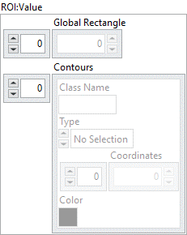
</td>
    </tr>
  </tbody>
</table>

<table>
  <tbody>
    <tr>
      <td valign="top" width="70%">
<strong>ROI:Value : <em>cluster,</em></strong> set ROIs shown on display and generate ROIs event (permissions : write only).

<table>
  <tbody>
    <tr>
      <td width="64" valign="top"></td>
      <td valign="top"><strong>Global Rectangle : <em>array, </em></strong>minimum rectangle required to contain all of the contours in the ROI. Rectangles are specified by their bounding rectangle, with the format (Left/Top/Right/Bottom)</td>
    </tr>
    <tr>
      <td width="64" valign="top"></td>
      <td valign="top"><strong>Contours : <em>array, </em></strong>are each of the individual shapes that define the ROI</td>
    </tr>
    <tr>
      <td></td>
      <td valign="top"><table>
  <tbody>
    <tr>
      <td width="64" valign="top"></td>
      <td valign="top"><strong>Class Name : <em>string, </em></strong>class name.</td>
    </tr>
    <tr>
      <td width="64" valign="top"></td>
      <td valign="top"><strong>Type : <em>integer, </em></strong>is the shape type of the contour.</td>
    </tr>
    <tr>
      <td width="64" valign="top"></td>
      <td valign="top"><strong>Coordinates : <em>array, </em></strong>are the coordinates that define the contour.</td>
    </tr>
    <tr>
      <td width="64" valign="top"></td>
      <td valign="top"><strong>Color : <em>integer,</em></strong> class color.</td>
    </tr>
  </tbody>
</table></td>
    </tr>
  </tbody>
</table></td>
      <td valign="top" width="30%">

</td>
    </tr>
  </tbody>
</table>

<table>
  <tbody>
    <tr>
      <td valign="top" width="70%">
<strong>User Color Palette : <em>array, </em></strong>color palette used to apply color mapping to the image :

<table>
  <tbody>
    <tr>
      <td width="64" valign="top"></td>
      <td valign="top"><strong>Red : <em>unsigned integer, </em></strong>value of the red color plane.</td>
    </tr>
    <tr>
      <td width="64" valign="top"></td>
      <td valign="top"><strong>Green: <em>unsigned integer, </em></strong>value of the green color plane.</td>
    </tr>
    <tr>
      <td width="64" valign="top"></td>
      <td valign="top"><strong>Blue: <em>unsigned integer, </em></strong>value of the bluecolor plane.</td>
    </tr>
  </tbody>
</table></td>
      <td valign="top" width="30%">
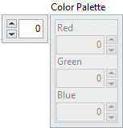
</td>
    </tr>
  </tbody>
</table>

<strong>User Event (Annotation):Class Added : <em>refnum,</em></strong> user event linked to annotation class added (permissions : read only). <strong>User Event (Annotation):Class Updated: <em>refnum,</em></strong> user event linked to annotation class updated (permissions : read only). <strong>User Event (Value Changed):Color : <em>refnum,</em></strong> user event linked to color value changed (permissions : read only). <strong>User Event (Value Changed):Info Box Position : <em>refnum,</em></strong> user event linked to label position value changed (permissions : read only). <strong>User Event (Value Changed):Lock : <em>refnum,</em></strong> user event linked to lock value changed (permissions : read only). <strong>User Event (Value Changed):Lock Visible : <em>refnum,</em></strong> user event linked to lock visible value changed (permissions : read only). <strong>User Event (Value Changed):Mouse Down : <em>refnum,</em></strong> user event linked to mouse down value changed (permissions : read only). <strong>User Event (Value Changed):Mouse Move : <em>refnum,</em></strong> user event linked to mouse move value changed (permissions : read only). <strong>User Event (Value Changed):Mouse Up : <em>refnum,</em></strong> user event linked to mouse up value changed (permissions : read only). <strong>User Event (Value Changed):Palette Direction : <em>refnum,</em></strong> user event linked to palette direction value changed (permissions : read only). <strong>User Event (Value Changed):Palette Mode : <em>refnum,</em></strong> user event linked to palette mode value changed (permissions : read only). <strong>User Event (Value Changed):Palette Position : <em>refnum,</em></strong> user event linked to palette position value changed (permissions : read only). <strong>User Event (Value Changed):ROIs : <em>refnum,</em></strong> user event linked to palette position value changed (permissions : read only). <strong>User Event (Value Changed):Zoom Direction : <em>refnum,</em></strong> user event linked to ROIs value changed (permissions : read only). <strong>User Event (Value Changed):Zoom Position : <em>refnum,</em></strong> user event linked to zoom position value changed (permissions : read only). <strong>Zoom:Direction : <em>enum,</em></strong> decides whether the zoom palette is in vertical or horizontal direction (permissions : read/write).

<table>
  <tbody>
    <tr>
      <td valign="top" width="70%">
<strong>Zoom:Position : <em>cluster,</em></strong> position of the top left corner of the zoom palette (permissions : read/write).

<table>
  <tbody>
    <tr>
      <td width="64" valign="top"></td>
      <td valign="top"><strong>X : <em>integer,</em></strong> X coordinate.</td>
    </tr>
    <tr>
      <td width="64" valign="top"></td>
      <td valign="top"><strong>Y : <em>integer,</em></strong> Y coordinate.</td>
    </tr>
  </tbody>
</table></td>
      <td valign="top" width="30%">
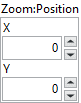
</td>
    </tr>
  </tbody>
</table>

<strong>Zoom:Visible : <em>boolean,</em></strong> indicates whether the zoom palette is visible (permissions : read/write).

