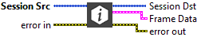
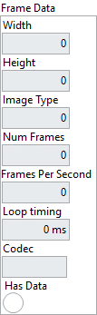
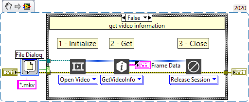
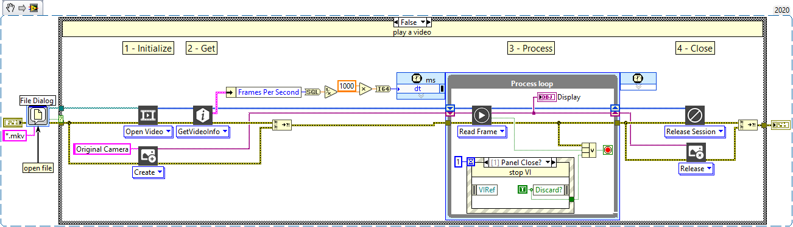

<h1>Get Video Info</h1>

<h2>Description</h2>

Obtains information about the video file. Type : <em><strong>polymorphic</strong><strong>.</strong></em>

<h3>Input parameters</h3>

<table>
  <tbody>
    <tr>
      <td width="64" valign="top"></td>
      <td valign="top"><strong>Session Src : <em>class</em></strong></td>
    </tr>
  </tbody>
</table>

<h3>Output parameters</h3>

<table>
  <tbody>
    <tr>
      <td width="64" valign="top"></td>
      <td valign="top"><strong>Session Dst : <em>class</em></strong></td>
    </tr>
  </tbody>
</table>

<table>
  <tbody>
    <tr>
      <td valign="top" width="70%"><table>
  <tbody>
    <tr>
      <td width="64" valign="top"></td>
      <td valign="top"><strong>Frame Data : <em>cluster, </em></strong>cluster containing information about the video.</td>
    </tr>
    <tr>
      <td></td>
      <td valign="top"><table>
  <tbody>
    <tr>
      <td width="64" valign="top"></td>
      <td valign="top"><strong>Width : <em>integer, </em></strong>specifies the width of the image.</td>
    </tr>
    <tr>
      <td width="64" valign="top"></td>
      <td valign="top">Height : <em>integer,</em> specifies the height of the image.</td>
    </tr>
    <tr>
      <td width="64" valign="top"></td>
      <td valign="top"><strong>Image Type :<em> integer, </em></strong>specifies the type of image used in the video file.
<ul>
<li>
<ul>
<li>
<ul>
<li>
<ul>
<li>Grayscale (U8) : 8 bits per pixel (unsigned, standard monochrome)</li>
<li>RGB (U32) : 32 bits per pixel (red, green, blue, alpha)</li>
<li>HSL (U32) : 32 bits per pixel (hue, saturation, luminance, alpha)</li>
</ul>
</li>
</ul>
</li>
</ul>
</li>
</ul></td>
    </tr>
    <tr>
      <td width="64" valign="top"></td>
      <td valign="top">Num Frames : <em>integer, </em>number of frames.</td>
    </tr>
    <tr>
      <td width="64" valign="top"></td>
      <td valign="top">Frames Per Second : <em>integer, </em>specifies the frame per second of the video.</td>
    </tr>
    <tr>
      <td width="64" valign="top"></td>
      <td valign="top"><strong>Loop timing : <em>integer, </em></strong>period between two images.</td>
    </tr>
    <tr>
      <td width="64" valign="top"></td>
      <td valign="top">Codec :<em> string, </em>specifies the codec used to create the video file.</td>
    </tr>
    <tr>
      <td width="64" valign="top"></td>
      <td valign="top">Has Data :<em> boolean, </em>false if video file is empty.</td>
    </tr>
  </tbody>
</table></td>
    </tr>
  </tbody>
</table></td>
      <td valign="top" width="30%">

</td>
    </tr>
  </tbody>
</table>

<h2>Examples</h2>

All these examples are snippets PNG, you can drop these Snippet onto the block diagram and get the depicted code added to your VI (Do not forget to install Computer Vision ​library to run it).

<h3>Simple use of Get Video Info</h3>

1 – Initialize

Open video reference.

2 – Get

Use the “GetVideoInfo” function to retrieve certain information about the video.

3 – Close

We close all open references.

<h3>Open and play a video</h3>

