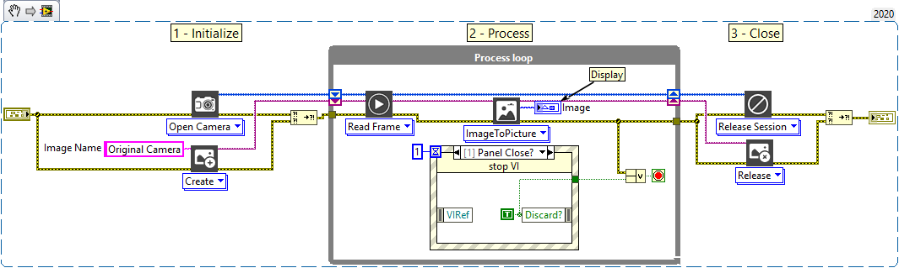
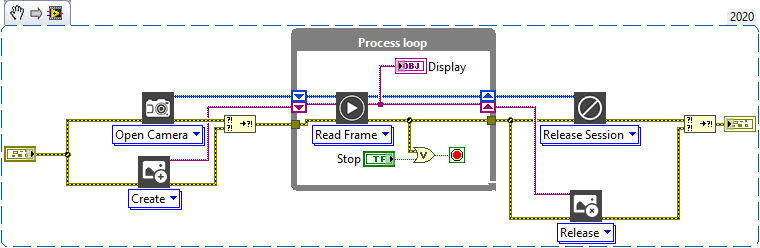

<h1>Open Camera</h1>

<h2>Description</h2>

Opens camera reference according to index. Type : <em><strong>polymorphic</strong><strong>.</strong></em>

<h3>Input parameters</h3>

<table>
  <tbody>
    <tr>
      <td width="64" valign="top"></td>
      <td valign="top"><strong>Camera : <em>integer, </em></strong>camera index.</td>
    </tr>
  </tbody>
</table>

<h3>Output parameters</h3>

<table>
  <tbody>
    <tr>
      <td width="64" valign="top"></td>
      <td valign="top"><strong>Session Dst : <em>class</em></strong></td>
    </tr>
  </tbody>
</table>

<h2>Examples</h2>

<a href="https://www.youtube.com/embed/dLkRw9v3Z6Y?feature=oembed">Get started - Open a camera with TIGR vision toolkit for LabVIEW</a>

All these examples are snippets PNG, you can drop these Snippet onto the block diagram and get the depicted code added to your VI (Do not forget to install Computer Vision library to run it).

<h3>Open and play a camera with LabVIEW picture display</h3>

1 – Initialize

Open camera reference and create a temporary memory allocation for an image.

2 – Process

Each loop reads the last frame and displays this frame.

3 – Close

We close all open references.

<h3>Open and play a camera with CV display</h3>

1 – Initialize

Open camera reference and create a temporary memory allocation for an image.

2 – Process

Each loop reads the last frame and displays this frame.

3 – Close

We close all open references.

