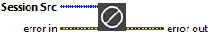

<h1>Release Session</h1>

<h2>Description</h2>

Close the session reference (Video/Camera). Type : <em><strong>polymorphic</strong><strong>.</strong></em>

<h3>Input parameters</h3>

<table>
  <tbody>
    <tr>
      <td width="64" valign="top"></td>
      <td valign="top"><strong>Session Src : <em>class</em></strong></td>
    </tr>
  </tbody>
</table>

<h2>Examples</h2>

All these examples are snippets PNG, you can drop these Snippet onto the block diagram and get the depicted code added to your VI (Do not forget to install Computer Vision ​library to run it).

<h3>Open and play a camera</h3>

1 – Initialize

Open camera reference and create a temporary memory location for an image.

2 – Process

Each loop reads the last frame and displays this frame.

3 – Close

We close all open references.

