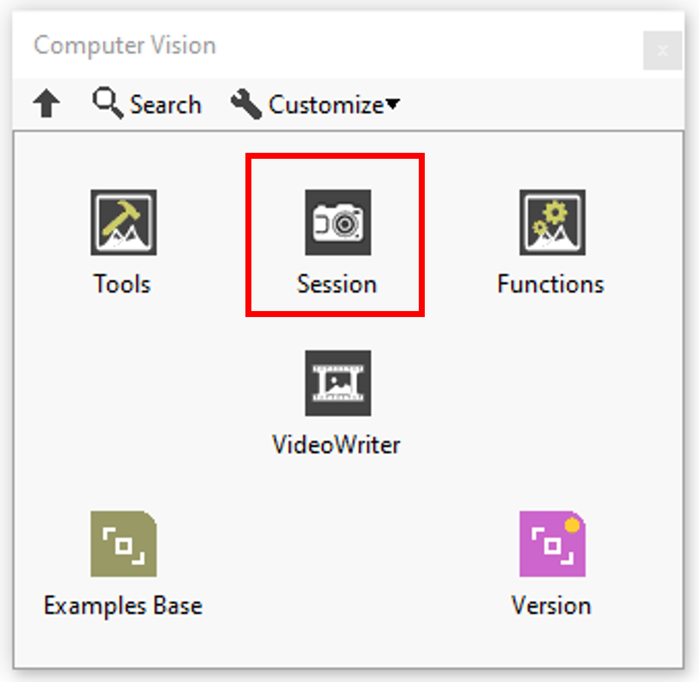
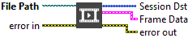
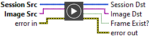
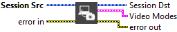
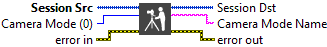
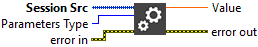
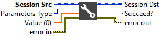

<h1>Session resume</h1>

In this section you’ll find a list of Session function available.

|  | **ICONS** | **RESUME** |
| --- | --- | --- |
| [Open Camera](../open-camera/README.md) |  | Opens camera reference according to index. |
| [Open Video](../open-video/README.md) |  | Create video session reference from the path file. |
| [Read Frame](../read-frame/README.md) |  | Read the last frame. |
| [Get Video Info](../get-video-info/README.md) |  | Obtains information about the video file. |
| [Get Camera Modes](../get-camera-modes/README.md) |  | Enumerates camera mode for the actual camera instance. |
| [Set Camera Mode](../set-camera-mode/README.md) |  | Modify the camera mode (Resolution and FPS). |
| [Get Session Parameters](../get-session-parameters/README.md) |  | Retrieve a parameter from the session reference (Camera/Video). |
| [Set Session Parameters](../set-session-parameters/README.md) |  | Sets a property in the session. |
| [Release Session](../release-session/README.md) |  | Close the session reference (Video/Camera). |
