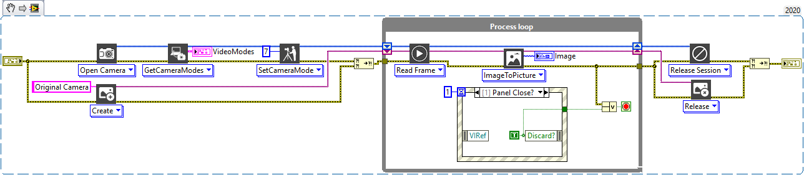

<h1>Set Camera Mode</h1>

<h2>Description</h2>

Modify the camera mode (Resolution and FPS). Type : <em><strong>polymorphic</strong><strong>.</strong></em>

<h3>Input parameters</h3>

<table>
  <tbody>
    <tr>
      <td width="64" valign="top"></td>
      <td valign="top"><strong>Session Src : <em>class</em></strong></td>
    </tr>
    <tr>
      <td width="64" valign="top"></td>
      <td valign="top">Camera Mode :<em> integer,</em> index for this video mode.</td>
    </tr>
  </tbody>
</table>

<h3>Output parameters</h3>

<table>
  <tbody>
    <tr>
      <td width="64" valign="top"></td>
      <td valign="top"><strong>Session Dst : <em>class</em></strong></td>
    </tr>
    <tr>
      <td width="64" valign="top"></td>
      <td valign="top">Camera Mode Name :<em> string,</em> name of the video mode, such as <strong>160×90 MJPG 30,00 fps.</strong></td>
    </tr>
  </tbody>
</table>

<h2>Examples</h2>

All these examples are snippets PNG, you can drop these Snippet onto the block diagram and get the depicted code added to your VI (Do not forget to install Computer Vision ​library to run it).

<h3>Opens and reads the camera in a defined mode</h3>

