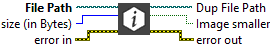

<h1>Check Size</h1>

<h2>Description</h2>

Check if the image is smaller than the size filled as input. Type : <em><strong>polymorphic</strong><strong>.</strong></em>

<h3>Input parameters</h3>

<table>
  <tbody>
    <tr>
      <td width="64" valign="top"></td>
      <td valign="top"><strong>File Path : <em>path, </em></strong>file path (BMP, TIFF, JPEG/JPG, TIFF, GIF, PNG, PPM, PGM and WebP).</td>
    </tr>
    <tr>
      <td width="64" valign="top"></td>
      <td valign="top"><strong>size (in Bytes)</strong> : <strong><em>integer,</em></strong> size to be compared with that of the image.</td>
    </tr>
  </tbody>
</table>

<h3>Output parameters</h3>

<table>
  <tbody>
    <tr>
      <td width="64" valign="top"></td>
      <td valign="top"><strong>Dup File Path : <em>path, </em></strong>file path (BMP, TIFF, JPEG/JPG, TIFF, GIF, PNG, PPM, PGM and WebP).</td>
    </tr>
    <tr>
      <td width="64" valign="top"></td>
      <td valign="top">Image smaller :<em> boolean,</em> is true if the input size is smaller than the image size.</td>
    </tr>
  </tbody>
</table>

<h2>Examples</h2>

All these examples are snippets PNG, you can drop these Snippet onto the block diagram and get the depicted code added to your VI (Do not forget to install Computer Vision library to run it).

