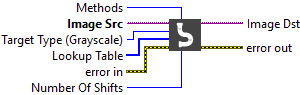

<h1>Cast Image</h1>

<h2>Description</h2>

Converts the current image type to the image type specified by “Target Type”. Type : <em><strong>polymorphic</strong><strong>.</strong></em>

<h3>Input parameters</h3>

<table>
  <tbody>
    <tr>
      <td width="64" valign="top"></td>
      <td valign="top"><strong>Image Src : <em>class</em></strong></td>
    </tr>
    <tr>
      <td width="64" valign="top"></td>
      <td valign="top">Target Type : <em>enum</em>, specifies the image type into which the input image is converted.
<ul>
<li>
<ul>
<li>Grayscale (U8) : 8 bits per pixel (unsigned, standard monochrome)</li>
<li>Grayscale (I16) : 16 bits per pixel (signed)</li>
<li>RGB (U32) : 32 bits per pixel (red, green, blue, alpha)</li>
<li>HSL (U32) : 32 bits per pixel (hue, saturation, luminance, alpha) </li>
</ul>
</li>
</ul></td>
    </tr>
    <tr>
      <td width="64" valign="top"></td>
      <td valign="top"><strong>Lookup Table : <em>array, </em></strong>is a grayscale replacement table. This input is an array containing a maximum of 256 elements if Image Src is an 8-bit image or a maximum of 65,536 elements if Image Src is a 16-bit image. Individual pixels within the image are not modified when the lookup table is missing a value that corresponds to those pixels. This input is valid only when converting from an 8-bit image to a 16-bit image, from a 16-bit image to an 8-bit image.</td>
    </tr>
    <tr>
      <td width="64" valign="top"></td>
      <td valign="top"><strong>Methods : <em>enum, </em></strong>specifies the casting method using which the input image is converted. This is valid only for 16-bit to 8-bit conversions.
<ul>
<li>
<ul>
<li>Use Bit Depth : use the bit depth information to cast.</li>
<li>Shift : uses the <strong>Number of Shifts</strong> input to cast the image. If a 16-bit image is being converted to an 8-bit image using this method, the VI executes this conversion by shifting the 16-bit pixel values to the right by the specified number of shift operations and then truncating to get an 8-bit value. If the value for <strong>Number of Shifts</strong> is 0, the pixel values are shifted by 0.</li>
<li>Use Lookup Table : uses the <strong>Lookup Table</strong> to perform casting.</li>
</ul>
</li>
</ul></td>
    </tr>
    <tr>
      <td width="64" valign="top"></td>
      <td valign="top"><strong>Number Of Shifts : <em>integer, </em></strong>specifies the number of right shifts by which each pixel value in the input image is shifted. This is valid only when converting from a 16-bit image to an 8-bit image. The VI executes this conversion by shifting the 16-bit pixel values to the right by the specified number of shift operations, up to a maximum of 8 shift operations, and then truncating to get an 8-bit value. This is valid only when <strong>Shift</strong> is selected for the <strong>Method</strong> input.</td>
    </tr>
  </tbody>
</table>

<h3>Output parameters</h3>

<table>
  <tbody>
    <tr>
      <td width="64" valign="top"></td>
      <td valign="top"><strong>Image Dst : <em>class</em></strong></td>
    </tr>
  </tbody>
</table>

<h2>Examples</h2>

All these examples are snippets PNG, you can drop these Snippet onto the block diagram and get the depicted code added to your VI (Do not forget to install Computer Vision ​library to run it).

