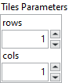
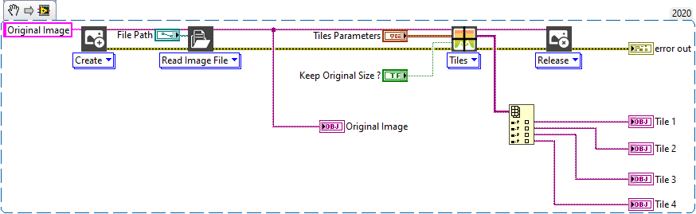

<h1>Tiles</h1>

<h2>Description</h2>

Slices an image into specified dimensions and optionally resizes tiles to the original image size. Type : <em><strong>polymorphic</strong><strong>.</strong></em>

<h3>Input parameters</h3>

<table>
  <tbody>
    <tr>
      <td width="64" valign="top"></td>
      <td valign="top"><strong>Image Src : <em>class</em></strong></td>
    </tr>
  </tbody>
</table>

<table>
  <tbody>
    <tr>
      <td valign="top" width="70%"><table>
  <tbody>
    <tr>
      <td width="64" valign="top"></td>
      <td valign="top"><strong>Tiles Parameters : <em>cluster</em>,</strong></td>
    </tr>
    <tr>
      <td></td>
      <td valign="top"><table>
  <tbody>
    <tr>
      <td width="64" valign="top"></td>
      <td valign="top"><strong>rows : <em>integer, </em></strong>number of tiles per column.</td>
    </tr>
    <tr>
      <td width="64" valign="top"></td>
      <td valign="top">cols : <em>integer, </em>number of tiles per row.</td>
    </tr>
  </tbody>
</table></td>
    </tr>
  </tbody>
</table></td>
      <td valign="top" width="30%">

</td>
    </tr>
  </tbody>
</table>

<table>
  <tbody>
    <tr>
      <td width="64" valign="top"></td>
      <td valign="top"><strong>Keep Original Size ? : <em>boolean,</em></strong> if true, we resize the tiles to the size of the source image.</td>
    </tr>
  </tbody>
</table>

<h3>Output parameters</h3>

<table>
  <tbody>
    <tr>
      <td width="64" valign="top"></td>
      <td valign="top"><strong>Dup Image Src : <em>class</em></strong></td>
    </tr>
    <tr>
      <td width="64" valign="top"></td>
      <td valign="top">Tiles : <em>array</em>, reference array containing the tiles.</td>
    </tr>
  </tbody>
</table>

<h2>Examples</h2>

All these examples are snippets PNG, you can drop these Snippet onto the block diagram and get the depicted code added to your VI (Do not forget to install Computer Vision ​library to run it).

