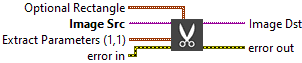
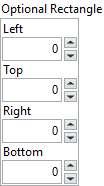
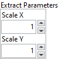

<h1>Extract</h1>

<h2>Description</h2>

Extracts (reduces) an image or part of an image with adjustment of the horizontal and vertical resolution. Type : <em><strong>polymorphic</strong><strong>.</strong></em>

<h3>Input parameters</h3>

<table>
  <tbody>
    <tr>
      <td width="64" valign="top"></td>
      <td valign="top"><strong>Image Src : <em>class,</em></strong>type accepted <strong>U8</strong>, <strong>I16</strong>, <strong>RGB</strong> and <strong>HSL</strong>.</td>
    </tr>
  </tbody>
</table>

<table>
  <tbody>
    <tr>
      <td valign="top" width="70%"><table>
  <tbody>
    <tr>
      <td width="64" valign="top"></td>
      <td valign="top"><strong>Optional Rectangle :<em> cluster, </em></strong>defines a four-element cluster that contains the left, top, right, and bottom coordinates of the region to process. The VI applies the operation to the entire image if the four-element are equal to 0.</td>
    </tr>
    <tr>
      <td></td>
      <td valign="top"><table>
  <tbody>
    <tr>
      <td width="64" valign="top"></td>
      <td valign="top"><strong>Left : <em>integer, </em></strong>left coordinate.</td>
    </tr>
    <tr>
      <td width="64" valign="top"></td>
      <td valign="top">Top :<em> integer, </em>top coordinate.</td>
    </tr>
    <tr>
      <td width="64" valign="top"></td>
      <td valign="top">Right :<em> integer, </em>right coordinate.</td>
    </tr>
    <tr>
      <td width="64" valign="top"></td>
      <td valign="top">Bottom :<em> integer, </em>bottom coordinate.</td>
    </tr>
  </tbody>
</table></td>
    </tr>
  </tbody>
</table></td>
      <td valign="top" width="30%">

</td>
    </tr>
  </tbody>
</table>

<table>
  <tbody>
    <tr>
      <td valign="top" width="70%"><table>
  <tbody>
    <tr>
      <td width="64" valign="top"></td>
      <td valign="top"><strong>Extract Parameters :<em> cluster,</em></strong></td>
    </tr>
    <tr>
      <td></td>
      <td valign="top"><table>
  <tbody>
    <tr>
      <td width="64" valign="top"></td>
      <td valign="top"><strong>Scale X : <em>float, </em></strong>vertical sampling step, which defines the columns to be extracted (the horizontal reduction ratio). For example, with an X equal to 3, one out of every three columns is extracted from the Image Src into the Image Dst. Each column is extracted if the default value (1) is used.</td>
    </tr>
    <tr>
      <td width="64" valign="top"></td>
      <td valign="top">Scale Y :<em> float,</em> horizontal sampling step, which defines the lines to be extracted (the vertical reduction ratio). Each row is extracted if the default value (1) is used.</td>
    </tr>
  </tbody>
</table></td>
    </tr>
  </tbody>
</table></td>
      <td valign="top" width="30%">

</td>
    </tr>
  </tbody>
</table>

<h3>Output parameters</h3>

<table>
  <tbody>
    <tr>
      <td width="64" valign="top"></td>
      <td valign="top"><strong>Image Dst : <em>class</em></strong></td>
    </tr>
  </tbody>
</table>

<h2>Examples</h2>

All these examples are snippets PNG, you can drop these Snippet onto the block diagram and get the depicted code added to your VI (Do not forget to install Computer Vision ​library to run it).

