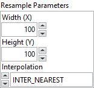

<h1>Resample</h1>

<h2>Description</h2>

Resamples an image to a user-defined size. Type : <em><strong>polymorphic</strong><strong>.</strong></em>

<h3>Input parameters</h3>

<table>
  <tbody>
    <tr>
      <td width="64" valign="top"></td>
      <td valign="top"><strong>Image Src : <em>class, </em></strong>type accepted <strong>U8</strong>, <strong>I16</strong>, <strong>RGB</strong> and <strong>HSL</strong>.</td>
    </tr>
  </tbody>
</table>

<table>
  <tbody>
    <tr>
      <td valign="top" width="70%"><table>
  <tbody>
    <tr>
      <td width="64" valign="top"></td>
      <td valign="top"><strong>Optional Rectangle :<em> cluster, </em></strong>defines a four-element cluster that contains the left, top, right, and bottom coordinates of the region to process. The VI applies the operation to the entire image if the four-element are equal to 0.</td>
    </tr>
    <tr>
      <td></td>
      <td valign="top"><table>
  <tbody>
    <tr>
      <td width="64" valign="top"></td>
      <td valign="top"><strong>Left : <em>integer, </em></strong>left coordinate.</td>
    </tr>
    <tr>
      <td width="64" valign="top"></td>
      <td valign="top">Top :<em> integer, </em>top coordinate.</td>
    </tr>
    <tr>
      <td width="64" valign="top"></td>
      <td valign="top">Right :<em> integer, </em>right coordinate.</td>
    </tr>
    <tr>
      <td width="64" valign="top"></td>
      <td valign="top">Bottom :<em> integer, </em>bottom coordinate.</td>
    </tr>
  </tbody>
</table></td>
    </tr>
  </tbody>
</table></td>
      <td valign="top" width="30%">

</td>
    </tr>
  </tbody>
</table>

<table>
  <tbody>
    <tr>
      <td valign="top" width="70%"><table>
  <tbody>
    <tr>
      <td width="64" valign="top"></td>
      <td valign="top"><strong>Resample Parameters :<em> cluster,</em></strong></td>
    </tr>
    <tr>
      <td></td>
      <td valign="top"><table>
  <tbody>
    <tr>
      <td width="64" valign="top"></td>
      <td valign="top"><strong>Width (X) : <em>integer, </em></strong>output image width.</td>
    </tr>
    <tr>
      <td width="64" valign="top"></td>
      <td valign="top">Height (Y) :<em> integer, </em>output image height.</td>
    </tr>
    <tr>
      <td width="64" valign="top"></td>
      <td valign="top">Interpolation :<em> integer, </em>specifies the interpolation method used to resample the image.
<ul>
<li>
<ul>
<li>
<ul>
<li>INTER_NEAREST : nearest neighbor interpolation</li>
<li>INTER_LINEAR : bilinear interpolation</li>
<li>INTER_CUBIC : bicubic interpolation</li>
<li>INTER_AREA : resampling using pixel area relation. It may be a preferred method for image decimation, as it gives moire’-free results. But when the image is zoomed, it is similar to the INTER_NEAREST method</li>
<li>INTER_LANCZOS4 : Lanczos interpolation over 8×8 neighborhood</li>
<li>INTER_LINEAR_EXACT : bit exact bilinear interpolation</li>
<li>INTER_NEAREST_EXACT : bit exact nearest neighbor interpolation</li>
</ul>
</li>
</ul>
</li>
</ul></td>
    </tr>
  </tbody>
</table></td>
    </tr>
  </tbody>
</table></td>
      <td valign="top" width="30%">

</td>
    </tr>
  </tbody>
</table>

<h3>Output parameters</h3>

<table>
  <tbody>
    <tr>
      <td width="64" valign="top"></td>
      <td valign="top"><strong>Image Dst : <em>class</em></strong></td>
    </tr>
  </tbody>
</table>

<h2>Examples</h2>

All these examples are snippets PNG, you can drop these Snippet onto the block diagram and get the depicted code added to your VI (Do not forget to install Computer Vision ​library to run it).

