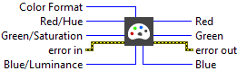

<h1>Color To RGB</h1>

<h2>Description</h2>

Extracts the three planes (RGB or HSL) from an image.​ Type : <em><strong>polymorphic</strong><strong>.</strong></em>

<h3>Input parameters</h3>

<table>
  <tbody>
    <tr>
      <td width="64" valign="top"></td>
      <td valign="top"><strong>Color Format : <em>enum, </em></strong>type of color space.
<ul>
<li>
<ul>
<li>RGB</li>
<li>HSL</li>
</ul>
</li>
</ul></td>
    </tr>
    <tr>
      <td width="64" valign="top"></td>
      <td valign="top"><strong>Red/Hue :<em> integer, </em></strong>red or hue value.</td>
    </tr>
    <tr>
      <td width="64" valign="top"></td>
      <td valign="top">Green/Saturation :<em> integer, </em>green or saturation value.</td>
    </tr>
    <tr>
      <td width="64" valign="top"></td>
      <td valign="top">Blue/Luminance :<em> integer, </em>blue or luminance value.</td>
    </tr>
  </tbody>
</table>

<h3>Output parameters</h3>

<table>
  <tbody>
    <tr>
      <td width="64" valign="top"></td>
      <td valign="top"><strong>Red : <em>integer, </em></strong>red value.</td>
    </tr>
    <tr>
      <td width="64" valign="top"></td>
      <td valign="top">Green : <em>integer, </em>green value.</td>
    </tr>
    <tr>
      <td width="64" valign="top"></td>
      <td valign="top">Blue : <em>integer, </em>blue value.</td>
    </tr>
  </tbody>
</table>

<h2>Examples</h2>

All these examples are snippets PNG, you can drop these Snippet onto the block diagram and get the depicted code added to your VI (Do not forget to install Computer Vision ​library to run it).

