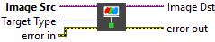

<h1>Extract Single Color Plane</h1>

<h2>Description</h2>

Extracts a single plane from a color image. Type : <em><strong>polymorphic</strong><strong>.</strong></em>

<h3>Input parameters</h3>

<table>
  <tbody>
    <tr>
      <td width="64" valign="top"></td>
      <td valign="top"><strong>Image Src : <em>class, </em></strong>type accepted <strong>RGB</strong> and <strong>HSL</strong>.</td>
    </tr>
    <tr>
      <td width="64" valign="top"></td>
      <td valign="top">Target Type :<em> integer, </em>defines the color plane to extract.
<ul>
<li>
<ul>
<li>Red : extracts the red color plane</li>
<li>Green : extracts the green color plane</li>
<li>Blue : extracts the blue color plane</li>
<li>Hue : extracts the hue color plane</li>
<li>Saturation : extracts the saturation color plane</li>
<li>Luminance : extracts the luminance color plane</li>
<li>Value : extracts the value color plane</li>
<li>Intensity : extracts the intensity color plane</li>
</ul>
</li>
</ul></td>
    </tr>
  </tbody>
</table>

<h3>Output parameters</h3>

<table>
  <tbody>
    <tr>
      <td width="64" valign="top"></td>
      <td valign="top"><strong>Image Dst : <em>class</em></strong></td>
    </tr>
  </tbody>
</table>

<h2>Examples</h2>

All these examples are snippets PNG, you can drop these Snippet onto the block diagram and get the depicted code added to your VI (Do not forget to install Computer Vision ​library to run it).

