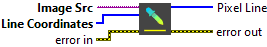

<h1>Get Color Pixel Line</h1>

<h2>Description</h2>

Extracts a line of pixels from a color image. Type : <em><strong>polymorphic</strong><strong>.</strong></em>

<h3>Input parameters</h3>

<table>
  <tbody>
    <tr>
      <td width="64" valign="top"></td>
      <td valign="top"><strong>Image Src : <em>class, </em></strong>type accepted <strong>RGB</strong> and <strong>HSL</strong>.</td>
    </tr>
    <tr>
      <td width="64" valign="top"></td>
      <td valign="top">Line Coordinates : <em>array, </em>array specifying the start x, start y, end x, and end y coordinates of the two end points of the line to extract.</td>
    </tr>
  </tbody>
</table>

<h3>Output parameters</h3>

<table>
  <tbody>
    <tr>
      <td width="64" valign="top"></td>
      <td valign="top"><strong>Pixel Line :<em> array, </em></strong>returns the pixel values as a 1D array of unsigned 32-bit integer indicators.</td>
    </tr>
  </tbody>
</table>

<h2>Examples</h2>

All these examples are snippets PNG, you can drop these Snippet onto the block diagram and get the depicted code added to your VI (Do not forget to install Computer Vision ​library to run it).

