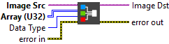

<h1>U32 Array To Color Image</h1>

<h2>Description</h2>

Creates a color image from a 2D array. Type : <em><strong>polymorphic</strong><strong>.</strong></em>

<h3>Input parameters</h3>

<table>
  <tbody>
    <tr>
      <td width="64" valign="top"></td>
      <td valign="top"><strong>Image Src : <em>class, </em></strong>type accepted <strong>RGB</strong> and <strong>HSL</strong>.</td>
    </tr>
    <tr>
      <td width="64" valign="top"></td>
      <td valign="top">Array (U32) :<em> array, </em>contains the pixel values as a 2D array of unsigned 32-bit integer controls.</td>
    </tr>
    <tr>
      <td width="64" valign="top"></td>
      <td valign="top"><strong>Data Type : <em>enum, </em></strong>type of color space.
<ul>
<li>
<ul>
<li>RGB</li>
<li>HSL</li>
</ul>
</li>
</ul></td>
    </tr>
  </tbody>
</table>

<h3>Output parameters</h3>

<table>
  <tbody>
    <tr>
      <td width="64" valign="top"></td>
      <td valign="top"><strong>Image Dst :<em> class</em></strong></td>
    </tr>
  </tbody>
</table>

<h2>Examples</h2>

All these examples are snippets PNG, you can drop these Snippet onto the block diagram and get the depicted code added to your VI (Do not forget to install Computer Vision ​library to run it).

