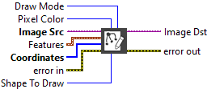
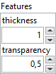

<h1>Draw Geometry</h1>

<h2>Description</h2>

Draw geometric objects in an image. Type : <em><strong>polymorphic</strong><strong>.</strong></em>

<h3>Input parameters</h3>

<table>
  <tbody>
    <tr>
      <td width="64" valign="top"></td>
      <td valign="top"><strong>Image Src : <em>class, </em></strong>type accepted <strong>U8</strong>, <strong>I16</strong>, <strong>RGB</strong> and <strong>HSL</strong>.</td>
    </tr>
    <tr>
      <td width="64" valign="top"></td>
      <td valign="top">Coordinates :<em> array, </em>is an array of four elements. A line is specified by the two points forming it. Rectangles and ovals are specified by their bounding rectangle, with the format (Left/Top/Right/Bottom). In these cases, the tracing of a rectangle or oval stops at the column (Right – 1) and at the row (Bottom – 1). The values by default are (0, 0, SizeX, SizeY) where (SizeX, SizeY) is the resolution of the image. The default is used if the input is 0 or is not connected.</td>
    </tr>
    <tr>
      <td width="64" valign="top"></td>
      <td valign="top">Shape To Draw :<em> integer, </em>is the form to draw.
<ul>
<li>
<ul>
<li>Line : defined by the two points specified in the array <strong>Coordinates</strong></li>
<li>Rectangle : defined by the bounding rectangle specified in the array <strong>Coordinates</strong></li>
<li>Oval : defined by the bounding oval specified in the array <strong>Coordinates</strong></li>
<li>Polygon : defined by the bounding polygon specified in the array <strong>Coordinates</strong></li>
</ul>
</li>
</ul>
<ul>
<li> </li>
</ul></td>
    </tr>
    <tr>
      <td width="64" valign="top"></td>
      <td valign="top"><strong>Pixel Color : <em>integer, </em></strong>pixel value used for tracing the design. This value is not used when in the mode Invert Frame or Invert Paint.</td>
    </tr>
    <tr>
      <td width="64" valign="top"></td>
      <td valign="top">Draw Mode : <em>integer, </em>defines how to draw the object.
<ul>
<li>
<ul>
<li>Frame : specifies to use <strong>Pixel Color</strong> when tracing the contour</li>
<li>Paint : specifies to use <strong>Pixel Color</strong> when tracing the contour and the interior of the shape</li>
<li>Invert Frame : specifies to use the inverse of the pixel values when drawing the contour</li>
<li>Invert Paint : specifies to use the inverse of the pixel values when drawing the contour and the interior of the shape</li>
</ul>
</li>
</ul></td>
    </tr>
  </tbody>
</table>

<table>
  <tbody>
    <tr>
      <td valign="top" width="70%"><table>
  <tbody>
    <tr>
      <td width="64" valign="top"></td>
      <td valign="top"><strong>Features : <em>cluster</em></strong>
<ul>
<li> <strong>thickness : <em>integer,</em></strong> line thickness of geometric object. <strong> transparency : <em>float,</em></strong> transparency percentage of geometric object. This value is not used when in the mode Invert Frame or Invert Paint.</li>
</ul>
<ul>
<li> </li>
</ul></td>
    </tr>
  </tbody>
</table></td>
      <td valign="top" width="30%">

</td>
    </tr>
  </tbody>
</table>

<h3>Output parameters</h3>

<table>
  <tbody>
    <tr>
      <td width="64" valign="top"></td>
      <td valign="top"><strong>Image Dst : <em>class</em></strong></td>
    </tr>
  </tbody>
</table>

<h2>Examples</h2>

All these examples are snippets PNG, you can drop these Snippet onto the block diagram and get the depicted code added to your VI (Do not forget to install Computer Vision ​library to run it).

