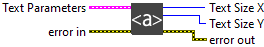
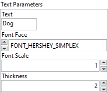

<h1>Get Text Size</h1>

<h2>Description</h2>

Return the size of the text in pixel. Type : <em><strong>polymorphic</strong><strong>.</strong></em>

<h3>Input parameters</h3>

<table>
  <tbody>
    <tr>
      <td valign="top" width="70%"><table>
  <tbody>
    <tr>
      <td width="64" valign="top"></td>
      <td valign="top"><strong>Text Parameters : <em>cluster</em></strong></td>
    </tr>
    <tr>
      <td></td>
      <td valign="top"><table>
  <tbody>
    <tr>
      <td width="64" valign="top"></td>
      <td valign="top"><strong>Text : <em>string, </em></strong>text string to be drawn.</td>
    </tr>
    <tr>
      <td width="64" valign="top"></td>
      <td valign="top">Font Face :<em> enum, </em>font type.
<ul>
<li>
<ul>
<li>
<ul>
<li>FONT_HERSHEY_SIMPLEX : normal size sans-serif font</li>
<li>FONT_HERSHEY_PLAIN : small size sans-serif font</li>
<li>FONT_HERSHEY_DUPLEX : normal size sans-serif font (more complex than FONT_HERSHEY_SIMPLEX)</li>
<li>FONT_HERSHEY_COMPLEX : normal size serif font</li>
<li>FONT_HERSHEY_TRIPLEX : normal size serif font (more complex than FONT_HERSHEY_COMPLEX)</li>
<li>FONT_HERSHEY_COMPLEX_SMALL : smaller version of FONT_HERSHEY_COMPLEX</li>
<li>FONT_HERSHEY_SCRIPT_SIMPLEX : hand-writing style font</li>
<li>FONT_HERSHEY_SCRIPT_COMPLEX : more complex variant of FONT_HERSHEY_SCRIPT_SIMPLEX</li>
</ul>
</li>
</ul>
</li>
</ul></td>
    </tr>
    <tr>
      <td width="64" valign="top"></td>
      <td valign="top"><strong>Font Scale : <em>float, </em></strong>font scale factor that is multiplied by the font-specific base size.</td>
    </tr>
    <tr>
      <td width="64" valign="top"></td>
      <td valign="top"><strong>Thickness : <em>integer, </em></strong>thickness of the lines used to draw a text.</td>
    </tr>
  </tbody>
</table></td>
    </tr>
  </tbody>
</table></td>
      <td valign="top" width="30%">

</td>
    </tr>
  </tbody>
</table>

<h3>Output parameters</h3>

<table>
  <tbody>
    <tr>
      <td width="64" valign="top"></td>
      <td valign="top"><strong>Text Size X : <em>integer, </em></strong>text size in X coordinates.</td>
    </tr>
    <tr>
      <td width="64" valign="top"></td>
      <td valign="top"><strong>Text Size Y : <em>integer, </em></strong>text size in Y coordinates.</td>
    </tr>
  </tbody>
</table>

<h2>Examples</h2>

All these examples are snippets PNG, you can drop these Snippet onto the block diagram and get the depicted code added to your VI (Do not forget to install Computer Vision ​library to run it).

