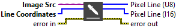

<h1>Get Pixel Line</h1>

<h2>Description</h2>

Extracts the intensity values of a line of pixels. Type : <em><strong>polymorphic</strong><strong>.</strong></em>

<h3>Input parameters</h3>

<table>
  <tbody>
    <tr>
      <td width="64" valign="top"></td>
      <td valign="top"><strong>Image Src : <em>class, </em></strong>type accepted <strong>U8</strong> and <strong>I16</strong>.</td>
    </tr>
    <tr>
      <td width="64" valign="top"></td>
      <td valign="top">Line Coordinates : <em>array, </em>array specifying the pixel coordinates that form the end points of the line.</td>
    </tr>
  </tbody>
</table>

<h3>Output parameters</h3>

<table>
  <tbody>
    <tr>
      <td width="64" valign="top"></td>
      <td valign="top"><strong>Pixel Line (U8) :<em> array, </em></strong>returns the intensity values for the specified line of pixels. Use this output only when image is an 8-bit image.</td>
    </tr>
    <tr>
      <td width="64" valign="top"></td>
      <td valign="top"><strong>Pixel Line (I16) :<em> array, </em></strong>returns the intensity values for the specified line of pixels. Use this output only when image is an 16-bit image​.</td>
    </tr>
  </tbody>
</table>

<h2>Examples</h2>

All these examples are snippets PNG, you can drop these Snippet onto the block diagram and get the depicted code added to your VI (Do not forget to install Computer Vision ​library to run it).

