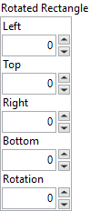
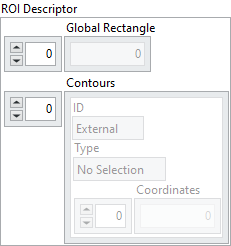

<h1>Rectangle To ROI</h1>

<h2>Description</h2>

Converts a rectangle or rotated rectangle to an ROI Descriptor. The contour of the ROI Descriptor returned is always of the type rotated rectangle.​ Type : <em><strong>polymorphic</strong><strong>.</strong></em>

<h3>Input parameters</h3>

<table>
  <tbody>
    <tr>
      <td valign="top" width="70%"><table>
  <tbody>
    <tr>
      <td width="64" valign="top"></td>
      <td valign="top"><strong>Rotated Rectangle :<em> cluster,</em></strong></td>
    </tr>
    <tr>
      <td></td>
      <td valign="top"><table>
  <tbody>
    <tr>
      <td width="64" valign="top"></td>
      <td valign="top"><strong>Left : <em>int, </em></strong>left edge.</td>
    </tr>
    <tr>
      <td width="64" valign="top"></td>
      <td valign="top"><strong>Top : <em>int, </em></strong>top edge.</td>
    </tr>
    <tr>
      <td width="64" valign="top"></td>
      <td valign="top"><strong>Right : <em>int, </em></strong>right edge.</td>
    </tr>
    <tr>
      <td width="64" valign="top"></td>
      <td valign="top"><strong>Bottom : <em>int, </em></strong>bottom edge.</td>
    </tr>
    <tr>
      <td width="64" valign="top"></td>
      <td valign="top"><strong>Rotation : <em>double, </em></strong>rotation in degrees.</td>
    </tr>
  </tbody>
</table></td>
    </tr>
  </tbody>
</table></td>
      <td valign="top" width="30%">

</td>
    </tr>
  </tbody>
</table>

<h3>Output parameters</h3>

<table>
  <tbody>
    <tr>
      <td valign="top" width="70%"><table>
  <tbody>
    <tr>
      <td width="64" valign="top"></td>
      <td valign="top"><strong>ROI Descriptor : <em>cluster, </em></strong>ROI descriptor containing all the contours in the array of ROIs.</td>
    </tr>
    <tr>
      <td></td>
      <td valign="top"><table>
  <tbody>
    <tr>
      <td width="64" valign="top"></td>
      <td valign="top"><strong>Global Rectangle : <em>array, </em></strong>contains the coordinates of the bounding rectangle. Rectangles are specified by their bounding rectangle, with the format (Left/Top/Right/Bottom).</td>
    </tr>
    <tr>
      <td width="64" valign="top"></td>
      <td valign="top"><strong>Contours : <em>array, </em></strong>are each of the individual shapes that define an ROI.</td>
    </tr>
    <tr>
      <td></td>
      <td valign="top"><table>
  <tbody>
    <tr>
      <td width="64" valign="top"></td>
      <td valign="top"><strong>ID : <em>enum, </em></strong>refers to whether the contour is the external or internal edge of an ROI.</td>
    </tr>
    <tr>
      <td width="64" valign="top"></td>
      <td valign="top"><strong>Type : <em>integer, </em></strong>is the shape type of the contour.</td>
    </tr>
    <tr>
      <td width="64" valign="top"></td>
      <td valign="top"><strong>Coordinates : <em>array, </em></strong>indicates the relative position of the contour.</td>
    </tr>
  </tbody>
</table></td>
    </tr>
  </tbody>
</table></td>
    </tr>
  </tbody>
</table></td>
      <td valign="top" width="30%">

</td>
    </tr>
  </tbody>
</table>

<h2>Examples</h2>

All these examples are snippets PNG, you can drop these Snippet onto the block diagram and get the depicted code added to your VI (Do not forget to install Computer Vision ​library to run it).

