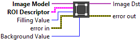

<h1>ROI To Mask</h1>

<h2>Description</h2>

Transform a Region of Interest into Mask. Type : <em><strong>polymorphic</strong><strong>.</strong></em>

<h3>Input parameters</h3>

<table>
  <tbody>
    <tr>
      <td width="64" valign="top"></td>
      <td valign="top"><strong>Image Model : <em>class</em></strong></td>
    </tr>
    <tr>
      <td width="64" valign="top"></td>
      <td valign="top">Filling Value :<em> integer, </em>pixel value of the mask. All pixels inside the region of interest take this value.</td>
    </tr>
    <tr>
      <td width="64" valign="top"></td>
      <td valign="top">Background Value :<em> integer, </em>pixel value of the background.</td>
    </tr>
  </tbody>
</table>

<table>
  <tbody>
    <tr>
      <td valign="top" width="70%"><table>
  <tbody>
    <tr>
      <td width="64" valign="top"></td>
      <td valign="top"><strong>ROI Descriptor : <em>cluster, </em></strong>descriptor that defines the region of interest.</td>
    </tr>
    <tr>
      <td></td>
      <td valign="top"><table>
  <tbody>
    <tr>
      <td width="64" valign="top"></td>
      <td valign="top"><strong>Global Rectangle : <em>array, </em></strong>minimum rectangle required to contain all of the contours in the ROI. Rectangles are specified by their bounding rectangle, with the format (Left/Top/Right/Bottom).</td>
    </tr>
    <tr>
      <td width="64" valign="top"></td>
      <td valign="top"><strong>Contours : <em>array, </em></strong>are each of the individual shapes that define the ROI.</td>
    </tr>
    <tr>
      <td></td>
      <td valign="top"><table>
  <tbody>
    <tr>
      <td width="64" valign="top"></td>
      <td valign="top"><strong>ID : <em>enum, </em></strong>refers to whether the contour is the external or internal edge of an ROI. If the contour is external, all of the area inside it is considered part of the ROI.</td>
    </tr>
    <tr>
      <td width="64" valign="top"></td>
      <td valign="top"><strong>Type : <em>integer, </em></strong>is the shape type of the contour.</td>
    </tr>
    <tr>
      <td width="64" valign="top"></td>
      <td valign="top"><strong>Coordinates : <em>array, </em></strong>are the coordinates that define the contour.</td>
    </tr>
  </tbody>
</table></td>
    </tr>
  </tbody>
</table></td>
    </tr>
  </tbody>
</table></td>
      <td valign="top" width="30%">

</td>
    </tr>
  </tbody>
</table>

<h3>Output parameters</h3>

<table>
  <tbody>
    <tr>
      <td width="64" valign="top"></td>
      <td valign="top"><strong>Image Dst : <em>class, </em></strong>output type is <strong>U8</strong>.</td>
    </tr>
  </tbody>
</table>

<h2>Examples</h2>

All these examples are snippets PNG, you can drop these Snippet onto the block diagram and get the depicted code added to your VI (Do not forget to install Computer Vision ​library to run it).

