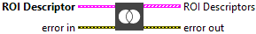
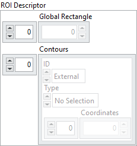
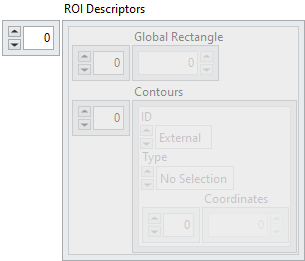

<h1>Ungroup ROIs</h1>

<h2>Description</h2>

Separates an ROI descriptor describing many contours into an array of ROI descriptors. Each of the ROI descriptors returned contains a single contour. Type : <em><strong>polymorphic</strong><strong>.</strong></em>

<h3>Input parameters</h3>

<table>
  <tbody>
    <tr>
      <td valign="top" width="70%"><table>
  <tbody>
    <tr>
      <td width="64" valign="top"></td>
      <td valign="top"><strong>ROI Descriptor : <em>cluster, </em></strong>descriptor that contains multiple contours.</td>
    </tr>
    <tr>
      <td></td>
      <td valign="top"><table>
  <tbody>
    <tr>
      <td width="64" valign="top"></td>
      <td valign="top"><strong>Global Rectangle : <em>array, </em></strong>minimum rectangle required to contain all of the contours in the ROI.  Rectangles are specified by their bounding rectangle, with the format (Left/Top/Right/Bottom).</td>
    </tr>
    <tr>
      <td width="64" valign="top"></td>
      <td valign="top"><strong>Contours : <em>array, </em></strong>are each of the individual shapes that define an ROI.</td>
    </tr>
    <tr>
      <td></td>
      <td valign="top"><table>
  <tbody>
    <tr>
      <td width="64" valign="top"></td>
      <td valign="top"><strong>ID : <em>enum, </em></strong>refers to whether the contour is the external or internal edge of an ROI.</td>
    </tr>
    <tr>
      <td width="64" valign="top"></td>
      <td valign="top"><strong>Type : <em>integer, </em></strong>is the shape type of the contour.</td>
    </tr>
    <tr>
      <td width="64" valign="top"></td>
      <td valign="top"><strong>Coordinates : <em>array, </em></strong>indicates the relative position of the contour.</td>
    </tr>
  </tbody>
</table></td>
    </tr>
  </tbody>
</table></td>
    </tr>
  </tbody>
</table></td>
      <td valign="top" width="30%">

</td>
    </tr>
  </tbody>
</table>

<h3>Output parameters</h3>

<table>
  <tbody>
    <tr>
      <td valign="top" width="70%"><table>
  <tbody>
    <tr>
      <td width="64" valign="top"></td>
      <td valign="top"><strong>ROI Descriptors : <em>array, </em></strong>returned array of ROI descriptors. Each ROI descriptor contains a single contour.</td>
    </tr>
    <tr>
      <td></td>
      <td valign="top"><table>
  <tbody>
    <tr>
      <td width="64" valign="top"></td>
      <td valign="top"><strong>Global Rectangle : <em>array, </em></strong>contains the coordinates of the bounding rectangle. Rectangles are specified by their bounding rectangle, with the format (Left/Top/Right/Bottom).</td>
    </tr>
    <tr>
      <td width="64" valign="top"></td>
      <td valign="top"><strong>Contours : <em>array, </em></strong>are each of the individual shapes that define an ROI.</td>
    </tr>
    <tr>
      <td></td>
      <td valign="top"><table>
  <tbody>
    <tr>
      <td width="64" valign="top"></td>
      <td valign="top"><strong>ID : <em>enum, </em></strong>refers to whether the contour is the external or internal edge of an ROI.</td>
    </tr>
    <tr>
      <td width="64" valign="top"></td>
      <td valign="top"><strong>Type : <em>integer, </em></strong>is the shape type of the contour.</td>
    </tr>
    <tr>
      <td width="64" valign="top"></td>
      <td valign="top"><strong>Coordinates : <em>array, </em></strong>indicates the relative position of the contour.</td>
    </tr>
  </tbody>
</table></td>
    </tr>
  </tbody>
</table></td>
    </tr>
  </tbody>
</table></td>
      <td valign="top" width="30%">

</td>
    </tr>
  </tbody>
</table>

<h2>Examples</h2>

All these examples are snippets PNG, you can drop these Snippet onto the block diagram and get the depicted code added to your VI (Do not forget to install Computer Vision ​library to run it).

