<h1>Tools resume</h1>

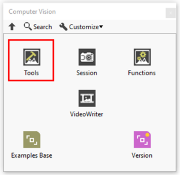

In this section you’ll find a list of Tools function available.

|  | **ICONS** | **RESUME** |
| --- | --- | --- |
| [Create](../image-manipulation/create-3/README.md) | 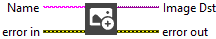 | Creates a temporary memory location for an image. |
| [Cast Image](../image-manipulation/cast-image/README.md) |  | Converts the current image type to the image type specified by “Target Type”. |
| [Copy](../image-manipulation/copy/README.md) |  | Create a copy of Image Src into Image Dst. |
| [Set Image Size](../image-manipulation/set-image-size/README.md) | 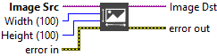 | Modifies the resolution of an image. |
| [Get Image Size](../image-manipulation/get-image-size/README.md) | 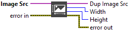 | Retrieve the image size (width and height). |
| [Get Image Info](../image-manipulation/get-image-info/README.md) | 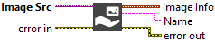 | Retrieve image information (name, size, and type). |
| [Image To Picture](../image-manipulation/image-to-picture/README.md) | 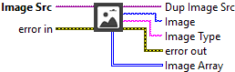 | Transform an image into a LabVIEW picture. |
| [Picture To Image](../image-manipulation/picture-to-image/README.md) | 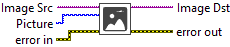 | Transform a LabVIEW picture into an image. |
| [Tiles](../image-manipulation/tiles/README.md) | 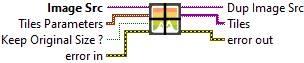 | Slices an image into specified dimensions and optionally resizes tiles to the original image size. |
| [Release](../image-manipulation/release/README.md) | 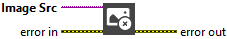 | Close image reference. |
| [Resample](../image-modification/resample/README.md) | 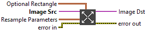 | Resamples an image to a user-defined size. |
| [Expand](../image-modification/expand-2/README.md) | 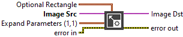 | Expands (duplicates) an image or part of an image by adjusting the horizontal and vertical resolution. |
| [Extract](../image-modification/extract/README.md) |  | Extracts (reduces) an image or part of an image with adjustment of the horizontal and vertical resolution. |
| [Insert Image](../image-modification/insert-image/README.md) | 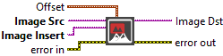 | Inserts an image in the Image Src. |
| [Rotate](../image-modification/rotate/README.md) | 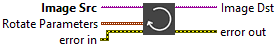 | Rotates an image. |
| [Shear](../image-modification/shear/README.md) | 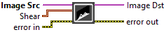 | Applies a shear effect to an image. This effect distorts the image by pushing it sideways or vertically, giving the impression that the image is tilted or slid in one direction without changing its surface. |
| [Shift](../image-modification/shift/README.md) | 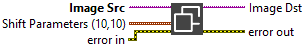 | Translates an image based on a horizontal and vertical offset. |
| [Flip](../image-modification/flip/README.md) | 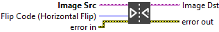 | Transforms an image through its symmetry. |
| [Image To Clipboard](../image-modification/image-to-clipboard/README.md) |  | Copies the image to the operating system clipboard. |
| [Read Image File](../files/read-image-file/README.md) | 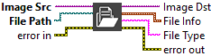 | Reads an image file. The file format can be a standard format (BMP, TIFF, JPEG, JPEG2000, PNG, and AIPD) or a nonstandard format known to the user. |
| [Get File Info](../files/get-file-info/README.md) | 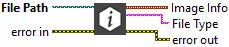 | Obtains information regarding the contents of the file. This information is supplied for standard file formats only : BMP, TIFF, JPEG, JPEG2000, PNG, or AIPD. |
| [Check Size](../files/check-size/README.md) |  | Check if the image is smaller than the size filled as input. |
| [BMP File](../../../_resolved/bmp-file/README.md) | 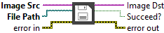 | Writes an image to a file in BMP format. |
| [JPEG2000 File](../../../_resolved/jpeg2000-file/README.md) | 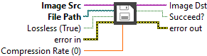 | Writes an image to a file in JPEG2000 format. |
| [JPEG File](../../../_resolved/jpeg-file/README.md) | 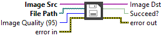 | Writes an image to a file in JPEG format. |
| [PNG File](../../../_resolved/png-file/README.md) | 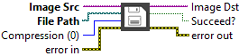 | Writes an image to a file in PNG format. |
| [Geometry](../pixel-editing/draw/geometry/README.md) |  | Draw geometric objects in an image. |
| [Text](../pixel-editing/draw/text/README.md) |  | Draw text in an image. |
| [Get Text Size](../pixel-editing/draw/get-text-size/README.md) |  | Return the size of the text in pixel. |
| [Extract Color Planes](../pixel-editing/color/extract-color-planes/README.md) | 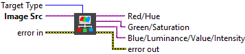 | Extracts the three planes (RGB, HSL, HSV, or HSI) from an image. |
| [Extract Single Color Plane](../pixel-editing/color/extract-single-color-plane/README.md) |  | Extracts a single plane from a color image. |
| [Color To RGB](../pixel-editing/color/color-to-rgb/README.md) |  | Extracts the three planes (RGB or HSL) from an image. |
| [Set Color Pixel Value](../pixel-editing/color/set-color-pixel-value/README.md) | 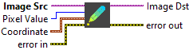 | Changes a pixel value in a color image. |
| [Get Color Pixel Value](../pixel-editing/color/get-color-pixel-value/README.md) | 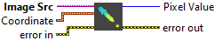 | Reads the pixel values from a color image. |
| [Set Color Pixel Line](../pixel-editing/color/set-color-pixel-line/README.md) | 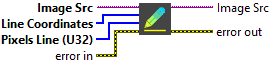 | Changes a line of pixels from a color image. |
| [Get Color Pixel Line](../pixel-editing/color/get-color-pixel-line/README.md) |  | Extracts a line of pixels from a color image. |
| [Color Image To U32 Array](../pixel-editing/color/color-image-to-u32-array/README.md) | 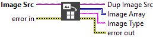 | Extracts the pixels from a color image or from part of a color image into a U32 2D array. |
| [Color Image To U8C3 Array](../pixel-editing/color/color-image-to-u8c3-array/README.md) | 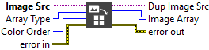 | Extracts the pixels from a color image or from part of a color image into a U8 3D array. |
| [U8 Array To Color Image](../pixel-editing/color/u8-array-to-color-image/README.md) | 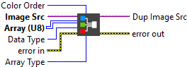 | Transform 3D U8 Array into Color Image. |
| [U32 Array To Color Image](../pixel-editing/color/u32-array-to-color-image/README.md) |  | Creates a color image from a 2D array. |
| [Set Pixel Line](../pixel-editing/grayscale/set-pixel-line/README.md) | 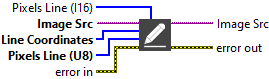 | Changes the intensity values in a line of pixels of an image. |
| [Get Pixel Line](../pixel-editing/grayscale/get-pixel-line/README.md) |  | Extracts the intensity values of a line of pixels. |
| [Set Pixel Value](../pixel-editing/grayscale/set-pixel-value/README.md) | 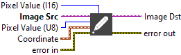 | Changes a pixel value in an image. |
| [Get Pixel Value](../pixel-editing/grayscale/get-pixel-value/README.md) | 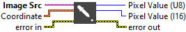 | Reads a pixel value from an image. |
| [Image To Array](../pixel-editing/grayscale/image-to-array/README.md) | 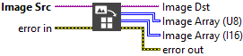 | Extracts the pixels from an image, into a U8 or I16 2D array. |
| [Image To U8 Array](../pixel-editing/grayscale/image-to-u8-array/README.md) |  | Extracts the pixels from an image, into a U8 2D array. |
| [U8 Array To Image](../pixel-editing/grayscale/u8-array-to-image/README.md) | 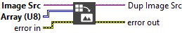 | Creates an image from a 2D array. |
| [I16 Array To Image](../pixel-editing/grayscale/i16-array-to-image/README.md) | 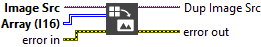 | Creates an image from a 2D array. |
| [Group ROIs](../region-of-interest/group-rois/README.md) | 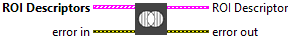 | Builds a single ROI descriptor from an of array ROI descriptors. |
| [Insert ROI Images](../region-of-interest/insert-roi-images/README.md) | 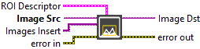 | Inserts multiple images in the Src Image. |
| [Mask To ROI](../region-of-interest/mask-to-roi/README.md) | 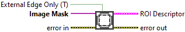 | Transform a mask into a region of interest. |
| [Rectangle To ROI](../region-of-interest/rectangle-to-roi/README.md) | 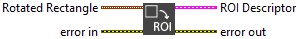 | Converts a rectangle or rotated rectangle to an ROI Descriptor. |
| [ROI To Mask](../region-of-interest/roi-to-mask/README.md) |  | Transform a Region of Interest into Mask. |
| [Ungroup ROIs](../region-of-interest/ungroup-rois/README.md) |  | Separates an ROI descriptor describing many contours into an array of ROI descriptors. |
| [Image ROI To Display ROI](../region-of-interest/image-roi-to-display-roi/README.md) |  | Convert Image ROIs to Display/Annotation ROIs. |
| [Display Image](../additional-windows/display-image/README.md) | 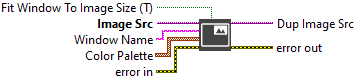 | Display the image on a separate window. |
| [Move Windows](../additional-windows/move-window/README.md) | 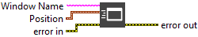 | Move the separate window according to its “Window Name”. |
| [Resize Windows](../additional-windows/resize-window/README.md) | 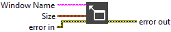 | Resize the separate window according to its “Window Name”. |
| [Release Windows](../additional-windows/release-windows/README.md) |  | Release the image on a separate window​. |
