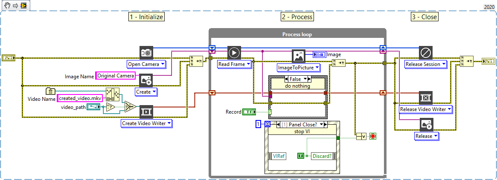

<h1>Release Video Writer</h1>

<h2>Description</h2>

Close the VideoWriter reference. Type : <em><strong>polymorphic</strong><strong>.</strong></em>

<h3>Input parameters</h3>

<table>
  <tbody>
    <tr>
      <td width="64" valign="top"></td>
      <td valign="top"><strong>VideoWriter Src : <em>class</em></strong></td>
    </tr>
  </tbody>
</table>

<h2>Examples</h2>

All these examples are snippets PNG, you can drop these Snippet onto the block diagram and get the depicted code added to your VI (Do not forget to install Computer Vision library to run it).

<h3>Create and write video</h3>

1 – Initialize

Open camera reference, create a temporary memory location for an image and create video reference.

2 – Process

Each loop reads the last frame and displays this frame. If the “Record” boolean is true, the image is saved in video.

3 – Close

We close all open references.

